title:그림으로 이해하는 AWS 구조와 기술

publisher : 길벗

writer : 오가사와라 시게타가

## 1장 아마존 웹 서비스 기초 지식 
**AWS: Amazon Web Services**

### 아마존 웹 서비스란: 아마존이 제공하는 클라우드 서비스

#### 아마존 웹 서비스란
클라우드 컴퓨팅 서비스 
서버 및 네트워크 등을 인터넷으로 빌려주는 서비스로, 언제 어디서든지 사용할 수 있다.
AWS의 다양한 서비스를 조합하여 모든 애플리케이션과 인프라를 구축할 수 있다.

시스템 운영에 필요한 서비스 일체를 사용할 수 있다.
서비스를 조합하기 쉽다.
종량제이므로 사용할 만큼만 빌릴 수 있다.
전문가가 아니어도 사용할 수 있다.
한국어와 한국 원화 결제가 가능하다.
각 나라의 보안기준과 글로벌 보안기준을 충족한다.
글로벌 확장이 쉽다 - 21개 지역 66개의 시설을 두고 있다.
(한국 - 서울)
목적에 따라 다양한 서비스를 제공한다.(165개 이상)

### AWS의 비용
초기 비용은 저렴하지만 운영 비용이 조금 비싸다.
- 향후에 필요하지만 지금은 필요 없는 자원을 확보해 둘 필요가 없다. 
최소로 필요한 만큼만 준비해서 시작하고 필요할 때 늘릴 수 있다.

장점 
1. 유연성: 이벤트나 캠페인과 같이 돌발적으로 접속 수가 늘어나는 웹사이트의 경우  확보
2. 대리 운영 : 관리하는 사람이 없어도 된다. + 기술적 지식이 부족해도 된다.

단점 : 그다지 접속 수 변동이 없는 시스템은 비용적 측면에서 불리할 수 있다.


### 서비스 이용의 용이성
#### 관리 콘솔 : GUI로 AWS를 조작하면 화면.
#### 매니지드 서비스 : AWS가 관리하는 서비스의 통칭
- 백업 및 업데이트가 자동으로 이루어진다.
->보안적 안심

but 매우 많은 서비스에 따른 다양한 형태를 구성할 수 있기 때문에, 어떻게 도입해야 할지 잘 검토하는 것이 중요하다.

 #### 어떤 지식이 필요한가?
 시스템의 구축-운영을 이해할 수 있는 인원과, 구축 책임자라면 네트워크나 서버의 기본적인 지식은 갖추고 있어야한다.
 
-------

## 2장 AWS를 이해하기 위한 클라우드 & 네트워크의 구조 

### 클라우드와 온프레미스 : 클라우드 컴퓨팅의 구조

### 클라우드란
언제, 어디서든 인터넷을 통해서 접속이 가능한 환경
클라우드 컴퓨팅 : 클라우드에 구축된 인프라를 활용하는 서비스나 이를 사용하는 것
일반적으로 클라우드는 클라우드 컴퓨팅을 가리킨다.

대표적인 클라우드 서비스 : AWS / Azure / Google Colud 등

### 온프레미스
자사가 서버 등을 구축하는 것
임대 서버 : 서버만 임대하는 경우
온프레미스 : 네트워크나 장소를 임대하는 경우 (도 여전히 온프레미스)
- 장점 : 자사에서 자유롭게 설계/운영
- 단점 : 서버 구성 변경 필요 가능성과 이를 대비한 숙력된 기술자 필요

온프레미스 <-> 임대 및 공용

#### 공용 클라우드와 사설 클라우드
공용 클라우드 : AWS와 같은 임대 클라우드
사설 클라우드 : 자사에 구축하는 클라우드 

온프레미스+클라우드 : 자사 클라우드
온프레미스+비클라우드 : 데이터 센터, 자사 서버
임대+클라우드 : AWS
임대+비클라우드 : 임대 서버 

### 가상화와 분산처리 
클라우드를 지탱하는 2대 기술

#### 가상화 
물리적 메모리, 하드 디크스, OS등 다양한 하드웨어를 소프트웨어로 대체하는 것 
```
가상 서버에 할당된 메모리와 스토리지는 자유롭게 늘리거나 줄일 수 있다.
소프트웨어처럼 구축하기 때문에 서버 복제가 쉽고 대수를 늘리거나 줄이기도 쉽다.
```

#### 분산처리 
기기 여러대에 분산하여 처리하는 방법
트래픽이 몰릴 때 집중을 분산할 수 있음.
**로드밸런서** 장치를 통해 여러 대의 서버에 분산시킴


#### 이중화
:시스템이나 서버에 문제가 생겨도 계속 가동할 수 있도록 조치하는 것을 말한다.
가상화와 분산처리는 이중화에 큰 도움이 된다.
서버 한 대에 문제가 생겨도 다른 서버에 의해 기능이 유지된다.

### SaaS, PaaS, IaaS 
클라우드의 서비스 제공 형태
**서비스를 어느 수준까지 제공하는가**의 분류기준.

#### SaaS(Software as a Service)
인프라, 플랫폼(OS)뿐 아니라 애플리케이션까지 제공.
ex)SNS / 블로그 / 웹 메일 등등

특징
- 편리한 반면 자유도가 낮다.
- 바로 사용할 수 있기 때문에 작업량이 적다.
- 특별한 지식이 필요 없다.
- 단말기 외에 준비할 것이 없다.

#### PaaS(Platform as a Service)
플랫폼까지만 제공 
OS가 설치된 서버에 사용자가 어플리케이션을 설치해 사용.
ex)임대 서버 등

특징
- 어플리케이션을 마음대로 설치할 수 있지만 대응하지 않는 어플도 있다.
- 서버 관리에 대한 지식이 필요하다.
- 경우에 따라서는 어플리케이션을 준비해야 할 필요가 있다.
- 중간 정도의 자유도
#### IaaS(Infrastructure as a Service)
인프라만 제공
ex)네트워크, 서버 머신 등 


특징
- 사용하려면 세팅이 필요하다.
- 서버 관리에 대한 지식이 필요하다.
- 경우에 따라서는 어플리케이션을 준비해야할 필요가 있다.
- 가장 높은 자유도

### 서버와 인스턴스 
AWS의 대표적인 서비스라면 Amazon EC2(Elastic Compute Cloud)이다.
: 서버를 임대하는 서비스.

Server란 어떠한 서비스를 제공하는 것.
제공 서비스에 따라 'OO서버'라고 한다.
OO서버를 만드는 것은 OO용 소프트웨어를 설치하고 그 기능을 갖추는 것이다.

컴퓨터 한 대에 여러 개의 서버를 설치할 수 있지만 성능이 저하되고, 장애가 발생했을 때 모든 기능이 멈추기 때문에 실제로 한 컴퓨터에 여러 소프트웨어를 설치하여 운영하는 경우는 별로 없다.

```
서버를 설치하는 컴퓨터 자체도 '서버'라고 한다. '기능으로서의 서버'와
서버 기능을 설치하는 '물리적인 컴퓨터로서의 서버'는 구분하도록 하자.
```

서버용 PC : 24시간 가동하는 것을 전제로 하기 때문에 불필요한 기능은 생략하고 잘 고장나지 않는 부품으로 구성되어 있다.

#### 서버용 OS
OS: 컴퓨터를 움직이기 위한 소프트웨어로, 하드웨어와 OS위에서 동작하는 소프트웨어 사이에서 중간 역할을 한다. 
서버용 OS : 유닉스계열-리눅스, BSD / 윈도우 계열


**유닉스 계열 : 오픈 소스로 개발되어 종류가 다양. **
웹 서버/ 메일 서버 등 인터넷에 사용되는 서버로 주로 사용됨.

다양한 배포판 : 커널(OS의 핵심)의 주변기능(기본적으로 명령이나 소프트웨어 등)을 추가한 패키지.
(리눅스계열 : RedHat, CentOS, Ubuntu, Debian ..)
(BSD 계열 : macOS, freeBSD ..)
**윈도계열**
Windows Server 한 가지만 존재 ->파일 서버의 OS로 많이 사용됨

#### 인스턴스와 서버
Amazon EC2에서 서버는 인스턴스로 생성된다.
**인스턴스** : '실체'라는 의미이며 실제 가동되고 있는 가상화 컴퓨터를 의미

### LAN
#### LAN(Local Area Network)
유선LAN / 무선LAN / 사내LAN 등..
사내LAN은 인터넷에 연결된 경우도 있고 아닌 경우도 있음.

인트라넷 : 인터넷에 연결되지 않은 폐쇄된 네트워크 범위
(군용망 등)

사내LAN에는 파일 서버, 웹 서버, 시스템 동작 서버 등이 포함되어 있는데, 최근 이러한 서버군을 AWS와 같은 클라우드에 이관하는 경우가 늘어나고 있다.

#### LAN을 구성하는 기술
- 라우터(router) : 네트워크 출입구가 되는 부분에 설치되는 기기. 일방향으로 들어온 데이터의 목적이를 확인하고 목적지에 가까운 다른 쪽 네트워크에 더이터를 전송한다.
- 허브(hub) : 네트워크 배선을 분할하는 기기. 같은 네트워크의 다른 단말기에 데이터를 전송한다.
- FW(FireWall) 방화벽. 들어오고 나가는 데이터를 확인하고 통신 여부를 조정하는 장치. 부정한 장소에서 접속하는 것을 금지하는 등 보안을 강화하는 데 사용한다. FW는 역할의 이름이므로 실제 조정하는 기기는 라우터나 서버, 전용 기기 등 다양하다.
- DMZ : 비무장 지대라고 하며, 인터넷과 같이 외부 네트워크와 사내 네트워크의 중간에 설치하는 네트워크이다. 어느 쪽에서든 접속이 가능한 서버를 설치한다.
- DHCP : 접속되어 있는 단말기에 자동으로 IP주소를 분배하는 방식이다.
- 서브넷 : 한 네트워크를 작게 분할한 네트워크이다.

### IP주소와 DNS
#### IP 주소란
인터넷상에서 서버나 네트워크, PC 등 호스트를 구별하는 주소나 이름표와 같은 것

AWS는 Elastic IP라는 IP주소가 있어서 변동이 많은 클라우드 서버라도 고정 IP주소에 접속할 수 있도록 되어 있다.

#### 사설 IP주소와 공인 IP주소

공인 IP주소 : 인터넷에 사용되는 것. 관리되는 주소이며 전 세계에 어느 것도 중복되는 일이 없다. 따라서 어떤 호스트인지 정확하게 확인할 수 있다.

사설 IP주소 : 사내LAN, 가정 LAN에 사용되는 주소.

가정, 회사와 같은 큰 단위에 공인IP주소를 할당하고, 그 내부에서 사설 IP주소를 할당하는 식이다.

#### DNS와 도메인
DNS란 URL에 포함된 이름에 해당하는 서버의 IP 주소를 알려주는 방식.
접속자는 URL로 접속한다고 생각하지만 실제는 DNS가 백그라운드에서 도메인명의 IP주소를 확인하고 접속시킨다.

AWS의 해당 서비스는 Route53

흐름 
URL -> DNS서버1(회사, 이용 인터넷 회사의 DNS서버) -> DNS 서버2 -> IP를 DNS서버1에 반환 -> IP를 이용자에게 반환 -> IP로 접속

DHCP : 가정이나 회사의 사설 IP주소는 DHCP방식에 의해 각 호스트에 할당된다. (Dynamic Host Configuration Protocol) 이 주소는 유효 기간이 있어 기간이 지나면 재할당된다. 따라서 PC나 프린터의 IP주소는 때에 따라서 바뀐다.

### 웹의 구조
#### 웹 서버의 구조
HTML이나 이미지 파일을 저장하고 있는 건 웹 서버이다.

DaaS(Desktop As Service)
PC환경을 가상화하여 네트워크에 구축하는 서비스.
어떤 pc를 사용하더라도 같은 PC환경을 이용해 작업할 수 있다.

-------

## 3장 AWS를 사용하기 위한 도구
### AWS의 사용법과 계정
**root 사용자**: 모든 권한을 가지고 있지만, 실수할 경우 치명적이고 도용된다면 매우 곤란해진다. 이러한 이유로 일반적인 운영에는 IAM을 사용한다. 
* IAM : 서비스를 사용하기 위한 사용자 계정. 그룹이나 정책 등을 일괄로 관리할 수 있다.

### 관리 콘솔과 대시보드
관리 콘솔 : 웹 브라우저에서 AWS 서비스를 관리하는 화면.
 Amazon Console 모바일 앱도 있음.
- CLI명령어를 사용하지 못하도 쉽게 사용/관리가능

### AWS IAM과 접근 권한
IAM : Identity and Access ManageMent(ID와 접속 관리)의 약어로 AWS의 인증 기능이다.

AWS 계정은 계약을 관리하는 계정.
IAM는 각 서비스에 대한 접속을 관리하는 계정.
IAM 사용자 : 사람에 대해 부여하는 IAM
IAM 자체는 추가 요금이 없다. IAM로 이용한 서비스는 당연히 요금이 부과된다.

사용자는 IAM 그룹으로 그룹화 가능.
->같은 권한을 부여하고 싶은 사용자를 일괄로 관리할 수 있다.

- 자격 기반 정책 : 실행자가 '어떤 일으 할 수 있는가'의 형태로 설정
- 리소스 기반 정책 : 조작 대상(서버 및 폴더 등)에 대해 '무엇을 허가할 것인가'의 형태로 설정

미리 정의되어있는 AWS 관리 정책을 이용 추천.

### Amazon CloudWatch
설치 시스템/소프트웨어의 감시(모니터링)은 직접 해야하기 때문에, 이 때 사용하는 것이 CloudWatch이다.
AWS서비스의 리소스 모니터링과 관리를 담당한다.
AWS서비스에서 지표, 로그 등을 수집 기록한다. 로그 임계 값 설정에 따른 특정 동작이 일어나도록 설정 가능하다.

#### 사용 가능한 조작과 Amazon CloudWatch Logs
가능 작업 : 이메일 송신, EC2 작동(인스턴스 시작/정지 등), Auto Scaling(인스턴수 수를 변경), Lamda함수 등등..

**Amazon CloudWatch Logs** : 각종 로그 기록 가능

### AWS Billing and Cost Management
AWS의 비용 관리

**AWS Cost Explorer**를 사용해 매월 어느 정도 비용이 발생했는지 서비스 단위별로 확인할 수 있다.(일별로도 가능)

**AWS Budgets**은 비용이 임계 값을 넘었을 때 알림을 발송할 수 있는 구조로 되어 있다.

#### 비용 관리 요령 
선택이 적절한가?
ex) 웹 서비스를 제작할 때 EC2 / S3에 구축하는 것이 가능하다. 
각각 자유도와 비용이 다르므로 자신에게 어떤 서비스가 바람직한가를 잘 분석해야 한다.

또한 한 개의 서비스가 여러 유형을 제공하거나, 옵션을 추가하는 것도 가능하기 때문에 잘 확인해야할 필요가 있다.

운영은 적절한가?
사용하지 않는 서비스나 실제로 불필요한 서비스를 유지하여 비용이 발생하는지 확인한다.

### 리전과 가용 영역
리전 : 데이터 센터. 리전에 따라 제공되는 서비스가 다르다.
ex)서울 리전을 선택했지만 제공하지 않는 서비스만 미국 동부 등 다른 리전을 선택해 사용할 수 있다.
또한 리전에 따라 비용이 다른 경우도 발생한다.
(언어 선택 리전과 관계 없이 지원)

-------
## 4장 서버 서비스 Amazon EC2
Amazon Elastic Compute Colud(Amazon EC2)는 컴퓨팅 용량을 제공하는 서비스이다. 서버에 필요한 세트를 클라우드에서 빌릴 수 있다.

임대 서버는 이미 만들어진 서버 기계나 서버 기능을 빌리는 것이지만, 클라우드의 경우에는 빌린 도구를 사용하여 자신의 서버를 만든다고 생각하면 된다.

#### EC2는 매니지드 서비스가 아니다. 
서버 및 네트워크 운영은 AWS가 담당하지만, OS를 포함하여 필요한 소프트웨어는 사용자가 직접 설치하고 운영해야 한다.

AWS에 의해서 강제로 업데이트되지 않는다. = 자유도 ↑ 관리필요성↑

다양한 서버 시스템의 조합(인스턶스 유형)과 OS 및 소프트웨어의 조합이 준비되어 있기 때문에 이를 선택하기만 하면 된다.

### ES2에 서버를 생성하는 장점
- 누구나 바로 사용할 수 있다.
-- 클릭 한 번으로 생성할 수 있다. (관리 콘솔)
-- 준비된 것을 선택할 수 있다. (AMI, 인스턴스 유형)
-- 나중에 변경하기 쉬우므로 일단 시작할 수 있다. (관리 콘솔, 인스턴스 유형)

- 여러 가지를 선택할 수 있다.
-- CPU와 메모리 사양이 다양하게 준비되어 있다.(인스턴스 유형)
-- OS나 소프트웨어의 종류가 다양하게 준비되어 있다.(AMI)
-- 연계하고 싶은 기능도 충실하게 되어 있다.(다른 AWS 서비스)

#### 바로 생성하고 바로 삭제할 수 있다.
->불확실성이 많은 경우에 매우 유용하다.
고장(서버 복제) / 부하 증가(서버 복제) / 접속량 변동(스케일 아웃, 다운) / 일시적 사용 등

### EC2의 사용 절차

EC2는 관리 콘솔에서 작업한다.
소프트웨어적인 작업은 클라우드가 아닌 환경이든 EC2이든 관계없이 SSH를 이용해 원격으로 로그인하여 작업한다. 여기서 SSH는 서버를 원격에서 작업하기 위한 프로토콜이다.

#### EC2 서비스의 기능
인스턴스 : AWS 클라우드에 생성한 가상 서버를 의미.

AMI : 가상 이미지. 인스턴스를 생성하는 기준이 되는 금형. OS만 설치된 간단한 유형부터 소프트웨어도 설정된 유형까지 다양한 AMI가 있다.

키 페어 : 인스턴스에 접속할 때 인증을 위해 사용하는 키.

EBS : AWS 클라우드에서 사용할 수 있는 스토리지. 인스턴스 스토리지로 사용한다.

보안 그룹 : 가상 방화벽으로, 1개 이상의 인스턴스 트래픽을 제한한다.

Elastic IP : 적정(고정) IPv4 주소이다.

#### EC2의 사용 절차
리전 선택 -> 관리 콘솔 -> EC2 대시보드 -> EC2인스턴스 생성 -> SSH로 EC2에 접속 -> 소프트웨어 설치, 설정

#### 인스턴스 설정 항목
AMI : EC2 인스턴스의 가상 이미지이며 소프트웨어 구성을 작성한 템플릿이다. 사용할 OS, 스프트웨어 등 어떤 인스턴스를 만들 것인지 정하고 이에 해당하는 AMI를 선택한다.
인스턴스 유형 : EC2 인스턴스의 장비 사양이다. CPU, 메모리, 장비 유형을 결정한다.
리전 : 서버를 설치할 지역이다. 전 세계에 이중화를 고려하는 경우는 다른 나라에도 설치한다.
네트워크 : EC2 인스턴스를 배치할 네트워크이다. AWS의 VPC(AWS계정 전용 가상 네트워크)에서 선택한다. VPC가 없으면 새로 생성하거나 기본 VPC를 사용한다.
서브넷 : 설치할 네트워크의 범위이다. VPC 내에 어떤 서브넷을 설치할지 선택한다. 서브넷을 선택하면 가용 영역이라고하는 설치 장소와 어떤 범위에 사설 IP가 부여될지 결정된다.
IAM 역할 : 인스턴스의 접속 권한 정책을 설정한다. 다른 서비스에 접속하고 싶을 때 할당ㅎ야 한다.
스토리지의 용량과 종류 : 서버 장비의 스토리지이다. OS가 설치된 장소에 있다. 기본적으로 EBS를 선택하고 사용할 디스크 용량과 스토리지의 종류를 선택한다.
용도에 따라서는 인스턴스 스토어(전원이 끊기면 데이터가 사라지지만 읽기 성능이 빨라진다. 일부 인스턴스 유형에 대응)을 선택해도 좋다. S3와 같은 외부 스토리지는 선택할 수 없다.
대크(EC2 인스턴스의 레이블) : 인스턴스에 임의의 태그를 부여할 수 있다. NANME태그를 사용하여 인스턴스 이름에 부여할 수 있으므로 사용하면 편리하다.
보안 그룹 : 프로토콜별로 포트 혹은 IP 주소, 아니면 양쪽 모두 필터링을 설정한다.

### AMI: OS 및 소프트웨어가 설치된 디스크 이미지
Amazon Machine Image는 EC2를 지탱하는 중요한 요소 중 하나이다.
AMI를 사용하면 동일한 인스턴스를 대량으로 쉽게 생성할 수 있다.

AMI:소프트웨어 구성을 기록한 템플릿.
AMI는 AWS 공식 AMI만 있는 것이 아니다.

```
- AMI -
Amazon Linux : 아마존이 제공하는 레드햇 기반 리눅스
CentOS :센트OS 리눅스
Ubuntu Server 
Tomcat Certified By Bitnami 
등등..
```

AMI는 경우 따라서 무료와 유료가 있다. 예를 들어 마이크로소프트가 제공하는 윈도 서버와 같이 원래 유료인 소프트웨어는 AMI에서도 유료이다.
또한, AMI를 개인이 생성할 경우에는 이미지의 용량에 따라서 요금이 부과된다.

AMI는 마켓플레이스라는 장소에서 배포할 수 있다. 
마켓플레이스 : AWS에서 AMI를 배포할 수 있는 장소이다. 유료, 무료에 관계없이 사용한다. 현재 수 천 개의 AMI가 공개되어 있다.
단, AMI가 반드시 안전하다는 보증은 없기 때문에 배보자를 잘 확인하고 사용하자.

### 인스턴스 유형
범용적인 것부터 컴퓨팅에 최적화된 것, 메모리에 최적화된 것까지 다양하게 선택할 수 있다. 

인스턴스 유형 : 머신의 성능이며 용도에 따라 선택할 수 있다.
-CPU, 메모리, 스토리지, 네트워크 용량  등이 용도에 맞게 조합되어 있다. 
인스턴스페는 유형과 크기가 있다. 

### Amazon EBS
EBS : 스토리지 볼륨. EC2와 조합하여 사용한.
HDD / SSS로 나뉘어져 있다.

#### EBS의 기능
탄력적 볼륨 : 볼륨 크기를 간단히 조정할 수 있는 기능.
스냅샷 : 어떤 시점의 데이터를 통째로 저장하는 기능
데이터 라이프 사이클 매니저 : 일정에 따라서 스냅샷을 생성, 삭제하는 기능
최적화 인스턴스 : 특정 인스턴스 유형을 최적화 인스턴스로써 읽기 쓰기를 고속화하는 기능이다.
암호화 : 데이터 볼륨, 부팅 볼륨 및 스냅샷을 암호화하는 기능이다.
KMS(AWS Key Management Service, 키를 생성/관리할 수 있는 기능)을 사용할 수 있다.

요금은 단가 X 저장 시간 

### SSH를 사용한 접속과 키 페어
일반적으로 EC2도 서버에 설치한 소프트웨어의 SSH로 관리한다. 이때 키 페어라는 방식을 사용하는데, 키 페어 파일을 분실하면 서버 자체를 다시 만들어야 한다.

#### SSH로 접속하기 
서버 성능을 조정 백업 등 서버의 전반적인 작업은 관리 콘솔에서 수행한다.
하지만 서버에 설치한 소프트웨어를 조작하려면 SSH 방식을 사용해 원격 접속으로 조작하는 것이 일반적.
따라서 서버에 SSH를 사용하기 위한 프로그램(데몬)을 기동하고, 클라이언트에는 조작하기 위한 소프트웨어를 설치해야 한다. 

#### 키페어
키 페어는 로그인할 때 인증으로 사용하며, 공개키와 비밀키로 된 한 쌍을 말한다. 
SSH로 서버(인스턴스)에 접속할 때 인스턴스쪽에서 키 페어에 포함되어 있는 '공개키'를 지정하고, 클라이언트쪽 소프트웨어는 내려받은 '키 페어 파일'을 '비밀키'로 설정하여 사용한다.
키 페어는 생성 시에면 내려받기가 가능하며 재발행이 안 된다.

### Elsastic IP 주소

EC2 인스턴스는 정지 후 다시 시작하면 공인 IP소가 바뀌게 된다. 이는 서버로서 사용하는데 문제가 되기 때문에, 고정 IP주소를 할당받아 인스턴스와 연결한다. 그러면 인스턴스를 삭제해도 같은 IP주소는 계속 남아있게 된다. 
이때 고정 IP주소로 사용되는 것이 Elastic IP 주소이다.

#### Elastic IP 주소의 확보와 부여
Elastic IP주소는 AWS계정에 연결되어 있다.
Elastic IP주소는 리전에 속하므로, 다른 리전이 보여하고 있는 IP주소는 사용할 수 없다.

요금
기본적으로 인스턴스에 부여된 IP한 개는 무료이고, 추가로 IP를 연결하면 시간에 비례하여 요금 부과된다. 중지돈 인스턴스 및 분리된 네트워크에 연결되어있어도 마찬가지. 따라서 사용하지 않는 IP주소는 해지하는 것이 좋다.

### Elastic Load Balancing 
:트래픽을 분배하는 분산장치. 서버를 안정적으로 운영할 수 있게 도와준다.

#### ELB?
서버에 집중되는 접속(트래픽)을 서버 여러 대나 네트워크에 분배하는 방식이다. 서버 한 대에 집중되는 부하를 분산시키기 때문에 **부하 분산** 장치라고도 한다.

#### ELB의 종류 
ALB, NLB, CLB 
-- ALB(Appication Load Balancer)
HTTP 및 HTTPS에 가장 적합한 로드 밸런서이다.
OSI모형의 어플리케이션 계층(구체적 통신을 제공하는 계층)에서 동작한다.
요청되는 명령어의 내용을 보고 판단하기 때문에 대상의 URL 디렉터리 단위로 분배하는 것이 가능하다.

하지만 분배 대상으로 정적 IP 주소를 설정하고 그 IP를 가진 호스트(기기)로 전송할 수 없다.
- 지원 프로토콜 : HTTP, HTTPS
WebSocket을 사용하여 경로 기반 라우팅, 호스트 기반 라우팅 및 양방향 통신 채널을 지원한다.


NBL(Network Load Balancer)
OSI 모형의 전송 계층(전송된 데이터의 제어를 담당하는 계층)에서 동작한다. 패킷이라고 불리는 단편 데이터밖에 볼 수 없기 때문에 ALB만큼 상세하게 분배할 수 없다. 대신 분배 대상의 정적 IP 주소를 설정할 수 있고 서버에 접속한 클라이언트의 IP주소를 그대ㅗㄹ 서버에 전송하도록 설정할 수도 있다.
- 지원 프로토콜 : TCP, TLS

CLB(CLassic Load Balancer)
고전 로드 밸런서.
지원 프로토콜이 많지만 앞으로 구축할 시스템에는 사용하지 않는 것을 권장한다.


### 스냅샷 
어떤 시점의 서버 디스크 상태를 통째로 보존한 파일이나 폴더 등의 집합. 데이터, 소프트웨어뿐만 아니라 OS와 설정 정보 등 모두 저장됨.

보통 백업용으로 스냅샷을 사용하지만, 개인이 AWS에서 AMI를 만들기 위해 사용하기도 한다.

첫 째는 통째로 보존하고, 두번째는 증분만 보존한다.
(가격 절약)

첫 번째 스냅샷을 삭제한 경우, 두번째로 복사된 뒤 삭제된다.

#### EBS 스냅샷을 생성하는 방법
스냅샷은 관리 콘솔에서 볼륨 단위(스토리지 전체)로 선택하여 생성.
데이터 수명 주기 관리자 (Amazon DLM)을 사용하면 스냅샷의 생성, 삭제를 자동화할 수 있다.

요금은 생성한 스냅샷의 GB단위로 발생한다.


### 오토 스케일링 : 수요에 맞춰 자동으로 EC2 대수를 증감
서버의 액세스 상태에 따라 서버 대수를 늘리거나 줄이는 기능이다.

#### 감시와 인스턴스 수의 결정
오토 스케일링을 시작하려면 'Auto Scaling 그룹(인스턴스의 집합)을 생성하고 그룹에 인스턴스(서버)의 최소 대수와 최대 대수를 설정해야 한다.
그러면 **이 범위 안에서** 인스턴스 수가 증감한다.

인스턴스의 증감에는 3가지 방법이 있다.
1.EC2 인스턴스가 정지한 경우 분리하고 새로운 EC2 인스턴스를 생성하는 방법
2.일정에 맞춰 스케일링하는 방법.
3.CPU와 네트워크의 부하를 참고하여 특정 임계값을 넘을 때 인스턴스 수를 자동적으로 증감하는 방법.

-오토 스케일링의 요금은 무료이다.(증설분은 당연히 돈이 나감) 하지만 CloudWatch를 사용할 경우 모니터링에 관련된 요금이 부과된다.

## 5장 스토리지 서비스 Amazon S3

### Amazon S3란 
Amazon S3는 스마트한 객체 스토리지 서비스이다.
S3의 가장 큰 특징은 기능이 많다는 것.
대표적 기능은 웹서버 기능과 쿼리기능이다.

#### 요금체계
보유하고 있는 용량/전송량(get/put)

### 스토리지 클래스 
스토리지의 종류를 스토리지 클래스 라고 한다.

스토리지 클래스는 Standard 외에도 액세스 패턴에 따라 계층(비용이 다른 층)을 이동할 수 있는 클래스, 액세스가 빈도가 낮은 데이터를 위한 클래스 등이 있어서 목적에 맞게 선택 가능.
버킷(객체를 저장하는 컨테이너) 단위가 아닌 객체(파일) 단위로  클래스를 선택할 수 있다.

### 스토리지 클래스의 종류
- Stnadard
3곳  이상의 AZ(가용 영역)에 데이터가 저장되어 있기 때문에 99.9%의 가용성(시스템에 계속해서 가동하는 것)을 보장한다.

- Intelligent-Tiering
S3 Intelligent-Tiering은 빈번한 액세스와 간헐적 액세스에 최적화된 두 가지 계층에 객체(파일)을 저장한다. 어느 쪽에 저장할지는 객체별로 모니터링하여 그 결과에 따라 자동으로 이동된다.

ex)30일간 연속 액세스가 없는 객체는 간헐적 액세스 계층으로 이동.
액세스가 다시 늘어나면 비번 액세스 계층으로 이동.
이 클래스는 검색 요금/이동 요금이 부과되지 않는다.
but 최소 저장 기간에 대한 요금이 설정되어 있다.

- Infrequent Access
Standard에 비해 저장 요금이 낮은 대신 애세스 요금이 조금 높다.
액세스 반도가 낮고 용량이 큰 데이터에 적합.

- Reduced Redundancy Storage(RRS)
낮은 가격 but AZ가 한 군데이므로 문제 발생시 데이터 유실 가능성이 있음.

- S3 Glacier/S3 Glacier Deep Archive
Glacier는 데이터 아카이브와 장기간 백업을 고려하여 만든 스토리지 클래스.
'볼트'라고 하는 컨테이너에 저장된다.
따라서 저장된 데이터를 읽는 경우 다른 S3 버킷으로 옮겨야 하는 작업이 필요하다.

### S3의 사용 절차

#### S3 조작
버킷의 생성 및 각종 설정과 같은 기본적인 S3 조작은 관리 콘솔의 S3대시보드에서 수행한다.

#### S3 서비스의 기능
객체 : S3의 엔티티 단위. 텍스트나 이미지등의 파일
버킷 : 객체를 저장하는 컨테이너. 모든 객체는 버킷에 저장된다.
버킷명 : S3 버킷의 명칭은 다른 AWS 사용자를 포함하여 유일해야 한다.
웹서버로 사용할 경우는 도메인명이 버킷명이 된다.
객체 키 : 객체 식별자. 모든 객체는 반드시 한 개의 키를 가진다. 버킷, 객체 키, 버전을 조합하여 객체를 고유하게 식별한다. (객체 이름이라고 생각하면 편함)
객체 메타 데이터 : 이름과 값의 세트. 객체를 업로드할 때 설정할 수 있다. 객체 키는 S3가 파일을 식별하기 위한 데이터이지만 메타데이터는 사람이 파일을 쉽게 관리하기 위한 데이터.
리전 : 버킷의 물리적인 보관 장소가 있는 지역을 말한다.
Amazon S3의 데이터 일관성 모델 : S3은 가용성을 유지하기 위해 데이터를 자동으로 복제하여 저장하지만 쓰기 지연에 의한 데이터 불일치가 발생하면 안 되기 때문에 데이터의 무결성을 보장한다. 복제가 모두 반영되기까지 다소 시간이 걸릴 수 있다.
버전 관리 : 여러 버전을 보관. 다른 버전은 별도의 객체로 쥐급하는 것이 가능
로그 : 버킷 단위나 객체 단위의 로그를 기록할 수 있다. 하지만 객체 수준의 경우는 유료.
암호화 : S3에 저장되는 데이터를 자동으로 암호화
액세스 제어 : S3 버킷에 대한 권한 설정
웹 서비스 : S3 버킷을 웹 사이트로 사용하는 기능.

#### S3의 사용 절차.
EC2와 마찬가지로 관리 콘솔에서 S3 대시보드를 열고 버킷을 생성 한다.

#### S3 버킷 생성 전 검토해야 할 것
S3 버키을 생성한 후에는 이름과 리전을 변경할 수 없다.
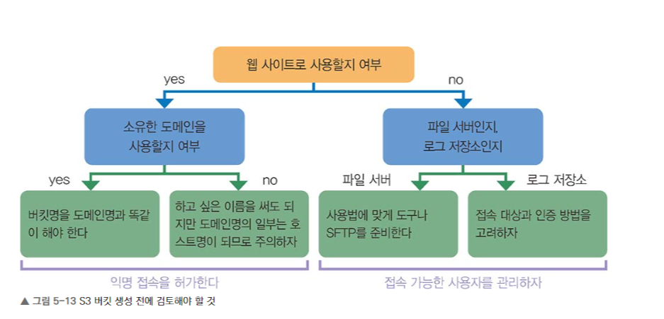


### 객체와 버킷 : 파일과 파일을 저장하는 장소

버킷 : 윈도 드라이브와 같은 것이고, 객체는 파일과 같은 것.
버킷은 폴더가 아니므로 버킷 안에 버킷을 다시 만드는 것은 불가능하다.
버킷 한 개에 저장할 수 있는 객체 수와 용량은 제한이 없다.

S3은 객체 스토리지이기 때문에 폴더나 디렉토리와 같은 개념이 없다.

객체는 버킷에 계층 구조가 아닌 병렬도 배치된다. 하지만 사용상 편의를 위해 관리 콘솔에 접속하면 폴더로 표시된다. 이렇게 생성된 폴더는 생성, 삭제, 업로드, 다운로드가 가능하다.

-S3에서 드라이브를 버킷이라 한다. 파일은 객체라 한다. 버킷에는 명명 규칙이 있다.

### 버킷 정책과 사용자 정책 : 액세스 제한 설정
S3 버킷 정책과 사용자 정책에 의해 버킷 접속을 제한할 수 있다.

#### S3 버킷에 대한 액세스 제한
- 버킷 정책 : 버킷 단위 제한
버킷에 접속하는 사용자를 지정
- 사용자 정책 : IAM 사용자 단위로 제한
접속 가능한 버킷을 지정
- 관리 정책 : ACL(액세스 제어 목록)에 의한 관리 정책
다른 계정에 대해 읽기/쓰기에 대한 허가/거부 설정 목록

#### 액세스 제한의 대상과 내용
액세스 제한은 리소스, 작업, 효과, 보안 주체에 대해 설정 가능.
'누가, 무엇을, 어떤 것에 대해 가능한가 여부'

- 리소스 : 제한 대상이 되는 버킷 및 객체. 아마존 리소스 이름을 사용하여 대상 식별
- 작업 : 실제로 가능한 작업. GET, DELETE가 있다. 작업 키워드를 사용하여 지정한다.
- 효과 : 설정 여부를 말한다. ALLOW, DENY를 설정
- 보안 주체 : 허가 / 거부할 사용자 및 계정, 서비스등을 말함.

### 웹 사이트 호스팅 : 웹 사이트 공개.

#### 웹 사이트 호스팅이란
S3는 정적 웹 사이트를 호스팅할 수 있다.
정적 웹 사이트 : 서버가 스크립트를 처리하지 않는 사이트. ex)HTML과 image만으로 이루어진 웹사이트 등.. 자바스크립트와 같은 클라이언트에서 처리하는 스크립트 포함 가능.
동적 웹사이트 : PHP, JSP, ASP.NET 등.. 서버에서 처리하는 언어가 포함된 사이트.

정적 웹사이트의 경우 URL설정 후 버킷을 그대로 오픈하면 웹 사이트가 됨.
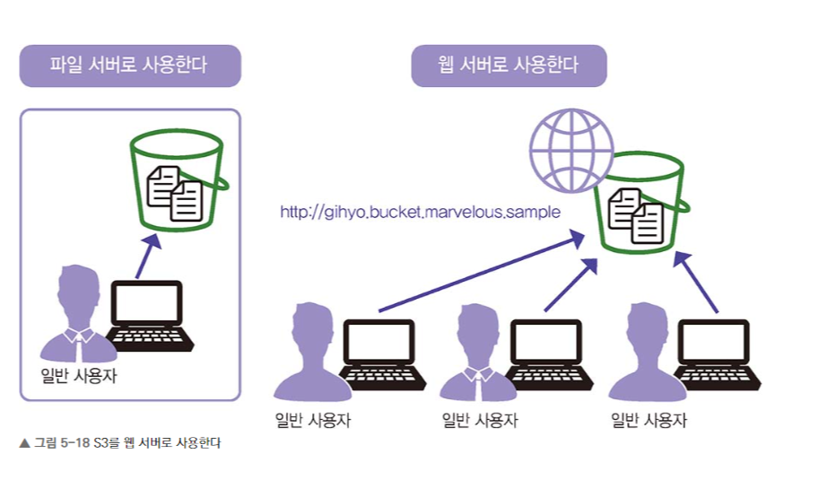

#### 웹 호스팅에 필요한 설정
- 정적 웹 호스팅 활성화
- 공용 액세스차단 해제 (public access)
- 버킷 정책 '모든 사용자' 설정
- 버킷명 : 사용할 도메인명으로 지정
- 개인 도메인 소지 경우 Amazon Route 53 등 DNS 서비스를 이용하여 설정.
- 무료(통신료 제외)
#### 다른 서비스로 구축한 웹 호스팅과의 차이


Amazon Lightsail 
- 필요한 기능을 선택하면 웹 사이트에 필요한 서비스 전체를 정해진 가격으로 구축할 수 있는 서비스.
ex)블로그 서버 구축 시 EC2의 경우 OS, 워드프레스, 고정 IP주소, DNS을 준비.
Lightsail : Lightsail만 계산.

다만 EC2 인스턴스와 달리 CPU, 메모리 같은 사양과 대수 변경불가능 등 유연성은 없음.

변경 시 스냅샷 -> LightSail사양 변경 신규 계약 -> 백업

AWS Amplify
- 웹을 개발하기 위한 도구 전체를 `제공하는 서비스로, 개발자 대상

자바스크립트로 AWS의 다양한 기능을 호출하여 시스템 구축.
HTML파일과 IMAGE를 S3를 통하여 배포하거나 Lambda를 사용하여 백엔드 프로그램 실행. AWS AMPLIFY는 이런 서비스를 조합하여 콘텐츠, 프로그램 배포.

### 파일 업로드와 다운로드 : 다양한 파일 업로드 방법
파일 업로드, 다운로드 : 관리콘솔, CLI 사용.
도구 및 프로그램에서 작업 : APIM SDK 사용.

- API와 SDK
API와 SDK를 사용하면 서드 파티(third party)도구를 사용해 파일을 업로드 할 수 있다.
IAM사용장게 액세스 키와 보안 액세스 키를 발행하여 사용하고 싶은 도구에 설정한다.

- 멀티 파트 업로드
객체를 여러 개로 나누어 세트 하나로 업로드 가능.
업로드 중에는 부분별로 표시되지만 업로드 완료되면 객체가 하나가 된다.

100MB 이상의 파일은 멀티 파트 업로드를 하는 것 추천. 업로드할 때 일반적인 요청이나 업로드에 대한 요금이 발생하지만 멀티 파트 업로드는 요금이 따로 발새앟지 않음.
관리 콘솔, CLI는 큰 파일을 업로드할 때 멀티 파터 업로드로 전환된다.

- AWS Transfer for SFTP
SFTP를 사용하여 파일을 전송.

- AWS DataSync
온프레미스 스토리지 시스템과 AWS 스토리지 서비스 간 대용량 데이터 전송을 위한 서비스. 

*공용 액세스  차단
버킷 단위로 모든 사용자에게 액세스를 허가할지 결정하는 기능.
각 액세스 제한보다 상위기능으로, 버킷 정책이나 사용자 정책이 모든 사용자에 대해 액세스가 가능하도록 허가되어 있다 하더라도 공용 액세스 차단이면 액세스 불가.

### 액세스 관리 및 변조 방지: 부정한 액세스 감시 
스토리지는 관리자가 아닌 사람이 액세스 하는 경우가 많기때문에 관리자가 작업 사항을 감시할 도구가 필요

#### 액세스 로그란 
서버에 어떤 요청이 있었는지를 기록.
버킷 소유자, 버킷명 요청자, 총 시간, 응답 시간, 작업, 응답 상태, 오류, 코드 등이 기록된다.
따로 요금은 부과되지 않음.

#### 그 외 액세스 관리 방법
- 스토리지 클래스 분석 
객체에 액세스 빈도를 분석. 액세스 빈도가 낮은 데이터는 S3 Intelligent-Tiering으로 이동하는 판단 자료로 사용된다.
대상 객체를 필터링해서 감시하는 것도 가능.

- 객체 잠금
객체 변경을 제한. 잠금 기능은 유효기간이 있지만, 법적으로 보존해야 하는 경우에는 제한 없음. 잠금 보호되는 버킷은 Cross-Region Replication(CRR)로 복사할 수 없다. 
  - 거버넌스 모드 : 특정 사용자에게만 객체 변경을 허가하는 모드.
  - 규정 준수 모드 : 모든 사양자가 객체 변경 불가. AWS계정 root 사용자도 변경 불가. 한 번 변경하면 변경불가하므로 주의.

- S3 인벤토리
인벤트리는 버킷에 들어있는 객체의 메타데이터의 목록을 매일 혹은 매주 생성하는 기능. CSV, ORc 등의 파일로 되어 있다.

*S3 배치 작업
Amazon S3 배치 작업을 사용하면 대상 객체에 대해 객체 복사, Amazon S3 Glacier에서 개체 복원 등 여러 작업 실행 가능. S3 배치 작업은 보통 Amazon S3 API를 사용하기 때문에 편리.

### 버전 관리·수명 주기·복제 : 저장된 객체 관리
- 버전 관리 : 객체를 여러 버전으로 저장하는 기능. 버킷 단위로 설정.
실수로 변경/삭제한 파일을 복원할 수 있다.

버전 관리는 미사용(기본), 활성화, 버전 일시 중지.

#### 수명 주기 정책 
S3은 수명 주기 정책을 설정 가능.
수명주기 정책 : 객체가 정기적으로 수행할 작업을 설정하는 기능.
Transition : 객체를 다른 스토리지 클래스로 이동
Expiration : 유효 기간이 만료된 객체 삭제. 객체관리되고있는 대상은 최선 버전에만 적용.
NoncurrentVersionTransition : 현재 스토리지 클래스에서 객체의 유지 시간을 지정.
NOncurrentVersionExpiration : 과거 버전의 객체를 삭제하기 전에 유지할 기간 지정.
AbortIncompleteMulipartUpload : 멀티 파트 업로드 진행 상태를 유지할 최대 시간을 지정.(지정 시간 내 업로드가 안되면 중지)
ExpiredObjectDeleteMarker : 만료된 객체 삭제 표시를 제거.


#### 교차 리전 복제

복제란 '복제본'을 생성하는 것.
교차 리전 복제 : 다른 리전의 버킷에 객체를 비동기적으로 복사.
복제에 사용할 두 버킷은 버전 관리가 활성화되어 있어야 한다.
같은 리전에 존재하는 버킷은 복제 설정 불가능.
이유 : 서울에 재해가 발생해도 데이터 유실않고 보존.

### 데이터 분석과 연계 : 저장된 데이터의 분석

데이터 분석과 연동 : S3의 객체나 객체의 내용에 대한 데이터를 분석하는 기능.

S3 Select
Amazon Athena : SQL SELECT문으로 정보 처리

#### 데이터 분석 서비스 

S3 Select : S3 로 저장된 데이터 파일 하나에 SQL문을 사용하여 집계 및 검색 가능. CVS파일 JSON외에도 로그 사용되는 Apache Parquet 형식도 지원한다.

Amazon Athena와 Amazon Redshit Spectrum
Amazon S3에 저장된 데이트 분석 가능.

S3 Select와 달리 어떤 대상에 대해 어떤 검색을 할지 사전 구성.
대신 여러 파일을 대상으로 수행 가능.

Amazon Athena와 Amazon Redshit Spectrum의 가장 큰 차이점은 분석을 위한 서버 존재 여부.

Athena는 매번 필요에 따라 분석용 서버를 자동으로 생성 실행. 
실행하는 순간만 비용
Redshift Spectrum은 미리 분석용 서버를 시작하고 이를 이용해 분석.
처리능력에 따라 저비용-고비용 서버 선택, 데이터 분산처리 가능.
대용량의 복잡한 데이터의 빠른 처리는 Redshit Spectrum이 좋다.

#### 데이터 분석 도구의 사용 구분


*AWS Lambda와 연동
Lambda는 이벤트 기반으로 코드를 실행하는 서비스.
ex)S3버킷에 객체를 업로드할 때 트리거로 Lambda함수를 호출하여 '특정 버킷에 이미지 파일을 업로드할 경우 해당 이미지의 썸네일을 생성한다. 파일이 업로드되면 알림을 보낸다.' 등등..

### Amazon CloudFront : 콘텐츠 배포 서비스
고속 콘텐츠 전송 네트워크 서비스. 
웹 콘텐츠를 빠르게 전송.
엣지 서버 사용. 각 리전 네트워크 말단에 위치함.
클라이언트 접속 네트워크 거리가 가깝기 때문에 반응속도도 빨라짐.
서버의 부하가 줄음.


#### Amazon CloudFront의 요금 체계
Amazon ClouldFront는 기본적으로 데이터 송신에 대한 요금이 부과됨.
서버에서 엣지서버로 원본 데이터 캐시는 무료.


*암호화 통신 지원
CloudFront는 TLS/SSL에 의한 암호화 통신 지원. https://로 시작하는 URL에 접속하는 통신은 암호화된다.

일반적으로 암호화는 서버 인증서가 필요하지만, AWS Certificate Manager 서버를 사용하면 무료로 서버 인증서를 생성할 수 있다.

## 6장 가상 네트워크 서비스 Amazon VPC
Amazon VPC(Amazon Virtual Private Cloud)
AWS 계정 전용 가상 네트워크 서비스로, AWS에서 제공하는 리소스만 설치할 수 있다. 특히 EC2, RDS의 경우 VPC를 선택하지 않으면 서버를 생성할 수 없기 때문에, 리소스를 사용하기 위해서는 반드시 필요하다.

#### VPC의 구성
VPC내에 서버를 설치하면 해당 네트워크에 소속되지만, 별도로 설정하지 않으면 VPC자체는 격리된 네트워크가 된다. 외부와 통신하려면 VPC를 인터넷 혹은 회사 내 LAN과 연결해야 한다.

* 일반 네트워크


* VPC 네트워크


#### VPC의 기능
VPC는 네트워크와 서브넷 범위, 라우팅 테이블, 네트워크 게이트웨이 등 가상 네트워킹 환경 설정 가능.
IPv4, IPv6 사용가능.

#### VPC 네트워크의 특징과 라우팅 테이블
VPC는 물리적 라우터가 아닌 소프트웨어가 라우터 역할을 한다.
라우팅은 설정된 라우팅 테이블에 따라 동작. 
물리적 서버 : LAN, Wifi로 라우터와 연결.
VPC : 라우팅 테이블로 라우터와 연결

### VPC의 사용절차 : 가상 네트워크를 사용하자

VPC는 네트워크이다. 따라서 서버(인스턴스)가 어떤 환경에 설치되어 있는지 그리고 인터넷에 연결해야 하는지에 대한 설정이 필요하다.
인터넷 연결 여부, 오토 스케일링이 중요.
인터넷 연결해야 한다면 : 게이트웨이 설정
오토 스케일링 : IP주소를 많이 확보해야 한다.(서버가 자동으로 늘어나기 때문에)

#### VPC의 사용 절차 
1.VPC이름 설정 2.CIDR블록에 네트워크 범위 설정 3.네트워크를 작게 서브넷을 나눔. 4.(인터넷 연결 시)인터넷 게이트웨이를 생성 후 라우팅 설정. 5.보안도 설정(보안 그룹, 네트워크 ACL 등)


### 기본 VPC : AWS가 제공하는 기본 VPC

네트워크 기본 지식이 부족하다면 기본 VPC를 사용 추천.

기본 VPC : 특별한 설정 없이 바로 사용 가능. 
(기본 VPC에서 Elastic Load Balancing)과 같은 서비스도 이용 가능
Elastic Load Balancing : 트래픽 분산 장치 

#### 기본 VPC의 구성
서브넷, 인터넷 게이트웨이가 기본적으로 구성되어 있다.
대시보드에서 EC2나 RDS를 생성할 때도 기본 VPC를 선택할 수 있다.

인터넷에 접속하고 싶지 않다면 별도의 VPC를 생성하거나 VPC 대시보드에 접속하여 기본 VPC를 변경해야 한다.

### 서브넷과 DHCP 

서브넷 : 커다란 네트워크를 작게 나눈 네트워크를 말한다.
네트워크를 분할해 직접 통신할 수 있는 범위를 좁히고, 방화벽을 설정해 보안을 강화하는 것을 목적으로 한다.

서브넷 A는 공개, 서브넷 B는 비공개 식으로 역할을 다르게 부여할 수도 있다.

#### 네트워크의 범위와 CIDR 표기
CIDR(Cdlassless Inter-Domain Routing)네트워크와 서브넷의 범위를 나누는 데 사용되는 표기법.

네트워크 길이를 숫자로 적어서 표기한다.

IP주소개수. /24 -> 256개 /20 4096개

#### 네트워크 클래스
규모에 따라 A, B, C 클래스로 나뉜다.


#### IP 주소 할당과 DHCP
일반적인 네트워크의 경우 IP주소를 할당할 수 있는 것은 EC2 인스턴스와 RDS 인스턴스(데이터베이스) 등이다. 하지만 AWS의 VPC는 EC2 인스턴스나 RDS인스턴나 RDS인스터스 외에도 라우터나 인터넷 게이트웨이의 IP주소로도 앞서 설명한 예약 주소를 사용할 수 있다.

DHCP(Dynamic Host Configuration Protocol)

### 라우팅과 NAT: 공인 IP 주소와 사설 IP 주소 변환

네트워크와 라우팅
네트워크 : PC여러 대가 서로 통신할 수 있도록 연결되어 있는 상태.

모든 pc를 1:1로 연결할 수 없기 때문에, 라우터로 모아서 다른 목적지로 보낸다.   

#### IP 주소와 게이트웨이
라우터는 정보를 전송할 때, IP를 기반으로 전송한다. 자신의 네트워크 내에 목적지가 있는지 확인하고, 없으면 다른 라우터로 보낸다.
-라우터는 게이트웨이라고도 한다.
게이트웨이중에 '자신 이외의 접속되어 있는 모든 것(대부분의 경우 인터넷과의 연결점)'을 **기본 게이트웨이**라고 한다.

#### IP 마스커레이드
LAN이외에는 대부분 인터넷을 거친다.
LAN에서 인터넷으로 데이터를 전송할 때 LAN 내부의 출입구가 되는 것이 게이트웨이이다. 게이트웨이는 기기의 역할을 말하며, 실제 기기는 라우터이다.

LAN 내부의 PC는 사설 IP주소를 할당하는데, 인터넷과 연결할 때 공인 IP로 변환하는 것이 IP 마스커레이드(NAPT)이다.

#### NAT
IP 마스커레이드틑 사용하면 내부에서 외부로 나가는 것은 가능하지만, 외부에서 내부로 들어오는 것은 불가능하다.
이럴 경우 서버만 양방향 통신가능하도록 IP 마스커레이드를 설정할 수 있다. 하지만 IP마스커레이드는 공인 IP를 한 개만 설정가능하기 때문에ㅡ 
NAT(Network Address Translation) : 공인 IP 주소를 여러 개 설정할 수 있음.ㅡ를 사용한다.

- IP 마스커레이드 : 1:N / 포트 변환 가능.
- NAT : N:N / 포트 변환 불가

NAT와 IP 마스커레이드는 AWS의 인터넷 게이트웨이와 NAT게이트웨이에 해당한다.

### 6.6 인터넷 게이트웨이와 NAT 게이트웨이 : VPC에서 인터넷으로 접속

#### 인터넷 게이트웨이
인터넷 게이트웨이는 인터넷 연결을 담당한다.
EC2 인스턴스에 웹 사이트를 설치했을 때 웹 사이트에 접속하는 사람은 그 페이지에 접속하고 싶다는 요청을 보낸다. 해당 요청은 DNS에서 변환되어 목적지인 공인 IP 주소로 전달된다. 하지만 EC2 인스턴스는 사설 IP주소밖에 설정할 수 없기 때문에 요청된 EC2 인스턴스의 연결 정보를 가지고 있는 인터넷 게이트웨이가 공인 IP주소(목적지)를 사설 IP주소로 변환하여 해당 EC2 인스턴스에 요청을 보낸다.


#### NAT 게이트웨이 
회사 내부에서만 사용하는 서버의 경우도 업데이트를 하려면 인터넷에 연결해야 할 때가 있다. 이럴 경우 NAT 게이트웨이를 사용한다.
NAT 게이트웨이는 서브넷에서 인터넷으로 접속할 수 있지만, 인터넷에서 서브넷으로 접속하지 못 하게 한다.


### 보안 그룹과 네트워크 ACL 보안 설정

#### 보안 그룹과 네트워크 ACL
VPC의 가상 방화벽

방화벽 : 네트워크 통신을 제어하는 방식
 ->인바운드 트래픽(데이터가 유입되는 것)
 ->아웃바운드 트래틱(데이터가 유출되는 것)

#### 인바운드 및 아웃바운드 설정과 알려진 포트
트래픽은 인바운드와 아웃바운드 각각에 대해 포트 단위로 허가 여부를 설정한다. 포트 번호로 지정한다.

포트 : '통신의 입구' 웹, 메일, FTP와 같이 서버에 어떤 데몬(서비스)이 동작할 때 해당 서비스를 사용하는 포트는 수신 대기 상태가 된다.

ex)웹 사이트 : http, https 포트를 연다.
사실 어떤 포트를 사용해도 상관은 없지만, 실제로는 서비스별로 잘 알려진 포트가 정해져 있어 그것을 보통 사용한다.

보안 그룹 : 인바운드 허가 x 아운바운드 허가 디폴트
네트워크 ACL : 양쪽 모두 허가 디폴트


데몬 : PC(서버)의 전원이 켜져 있는 동안 계속해서 동작하는 소프트웨어.
유닉스 OS에서는 데몬. 윈도 OS에서는 서비스라고 칭한다.
필요할 떄 기동하고 종료하는 워드 엑셀 같은 소프트웨어는 데몬이라 하지 않음.
웹 기능, 메일 기능은 데몬에 의해 실행된다.
즉, 상주하는 소프트웨어 = 데몬

보안 그룹 : 인스턴스에 설정하는 가상 방화벽
네트워크 ACL : 서브넷에 설정하는 가상 방화벽

### VPC 엔드포인트 : 다른 AWS 서비스 및 엔드포인트 서비스와 연결
AWS에는 VPC를 지원하는 서비스와 지원하지 않는 서비스가 있다. 이러한 서비스를 연동하려면 서로 접속할 수 있어야하는데, 이때 연결점이 되는 것이 VPC 엔드포인트이다.

VPC 엔드포인트 : VPC 내부에서 VPC 외부로 접속하기 위한 연결점을 제공하는 서비스.

VPC내부 / VPC 간은 통신이 자유롭지만 외부로 나가려면 인터넷 게이트웨이를 사용해야함. 번거롭고, 보안이 불안하다.
따라서 VPC 엔드포인트를 사용하여 외부 서비스와 직접 연결한다.

#### 인터페이스 엔드포인트와 게이트웨이 엔드포인트
VPC 엔드포인트는 가상 서비스이다. 확장성과 고가용성(멈추지않는 서비스)를 지원하며, 네트워크 트래픽에 대해 자동으로 스케일링 된다.

- 인터페이스 엔드포인트 : 네트워크 인터페이스로 구축
사설 IP주소를 가진 ENI가 존재. 
AWS PrivateLink 방식. (타사 서비스가 PrivateLink를 지원하면 사용가능.)
- 게이트웨이 엔드포인트 : 라우팅 테이블에 설정된 내용을 라우팅
서비스 리전 단위로 라우팅 테이블 설정하는 방식.
한 번 설정하면 해당 리전의 모든 서비스에 사용 가능.


#### VPC 엔드포인트의 요금
엔드포인트 자체는 무료이지만, 인터페이스 엔드포인트를 사용 경우 AWS PrivateLink 요금이 부과됨. + 데이터 송신료

### VPC 연결 

- VPC끼리의 연결 : VPC 피어링 기능 활성화.
- 물리적 네트워크 / 다른 클라우드와 연결 가능 : 회사 LAN, 온프레미스 와 연결하여 물리적 네트워크의 연장선으로도 사용 가능.
-> 인터넷상 서비스 뿐 아니라, 회사 시스템 구축도 사용가능
- LAN과 온프레미스 연결 시 제공되는 서비스
   - AWS Direct Connect : 전용선 서비스
   - AWS VPN : 가상 사설망 서비스

#### 전용선과 가상 사설망
WAN(Wide Area Network) : 네트워크와 네트워크를 연결해 커다란 네트워크를 구축하는 것. 1:1로 연결한다.

- 전용선 : 비싸지만 안전하고 신뢰성이 높다
- 가상 사설망 : 보유 회선 및 공용 회선을 사용하여 거점끼리 통신을 암호화 하여 연결한다. 비용은 저렴하지만 신뢰성이 떨어짐. 암호화 기술보안에 따라 신뢰성 결정.

#### AWS Direct Connect
AWS Direct Connect 엔드포인트를 연결점으로 접속. 
전용선이기 때문에 회선 공사가 필요 + 라우터 설치. -> 비용 비쌈
AWS Direct Connect 공유 설비를 사용하여 연결하여 비용절감도 가능.

#### AWS VPN
AWS VPN은 인터넷 VPN을 사용하여 다른 네트워크와 연결하는 방법.
인터넷을 이용한 연결 -> 회사 내 VPN 지원 라우터 설치되어 있으면 연결가능. -> VPN 연결이라고 한다.

간단한 반면 인터넷을 사용하므로 네트워크 품질과 속도를 보장하지는 않는다. 회선이 끊어지거나 느려지면 AWS VPN보다는 Direct Connect가 낫다.

#### 전송 게이트웨이
VPC나 온프레미스 네트워크를 하나로 묶어 서로 연결하는 '접속점'을 제공하는 서비스. 
네트워크 끼리 연결할 때는 연결 방식과 경로를 정하는 것이 기본인데, 수가 많아지면 굉장히 복잡해짐. 여러 네트워크를 중앙 거점으로 집작하여 통신 경로를 처리하는 서비스 : 전송 게이트웨이


## 데이터베이스 서비스 Amazon RDS

### 데이트베이스와 RDB
DB : 구조적으로 정리된 데이터의 집합체
DBMS(Database Management System) : DB 조작을 위한 소프트웨어

RDB와 비RDB

RDB(관계형 DB) : 엑셀과 같이 표 형태로 되어 있고, 데이터의 종류를 세세하게 설정한다. (구축에 시간이 든다.) 그만큼 정밀한 조작 가능. 데이터 관련 작업은 SQL을 사용한다.

```
비RDB(비관계형 DB) : 구조가 단순. 설정할 부분 ↓ but 복잡한 작업 x
SQL을 사용하지 않기 때문에 NoSQL DB라고도 불린다.
 키 밸류형 / 문서형 / 그래프형
```


### Amazon RDS : RDBMS를 제공하는 데이터베이스 서비스

#### Amazon RDS
Amazon Relational Database Service는 관계형 데이터베이스 6종류의 제품을 클라우드에 최적화된 상태로 제공하는 서비스.
Amazon Aurora, PostgreSQL, MySQL, MariaDB, Oracle Database, SQL Server를 지원. 
메모리, 성능, I/O 등이 최적화된 데이터베이스 인스턴스를 제공.

제공방식 : VPC상에 인스턴스 형태로 구축하며 다양한 인스턴스 클래스를 사용할 수 있다. EC2와 다른 점은 RDS는 '매니지드 서비스'이며 업데이트 등의 관리가 AWS에 의해 자동으로 이루어진다.
백업도 자동화 되어있음.

AWS Database Migration Server(DMS)를 사용하여 DB 이전, 복제도 가능.

#### 인스턴스 클래스
- 표준
- 메모리 최적화 : 메모리를 많이 사용하는 어플리케이션에 최적화
- 버스트 : 네트워크 EBS성능 강화, CPU 사용률 강화 등등의 기능

#### RDS의 요굼
1. 스토리지 요금 : 실제 사용 용량이 아닌 확보 용량에 대해 과금된다.
2. 데이터베이스 인스턴스 요금(DBMS 라이선스 요금 포함)
: 가동 시간당 요금 부과.
3. 백업 스토리지 요금 : 리전의 DB 스토리지 크기의 100%를 넘을 경우에만 발생. ex)20GB의 DB -> 스냅샷이 20GB 이내라면 요금 부과 x

4. 통신료 

다중 AZ 구성이란?
(Az : 가용 영역)
여러 가용 영역에 구축하여 이중화 구성을 구현하는 것.
장애가 발생하여 중단되면 안 되는 서비스 환경일 때 다중 AZ구성을 사용하는 것이 좋다.

#### RDS의 장단점
장점 : 매니지드 서비스. DB 생성이 간단. 온프레미스에서 데이터를 이전하기 쉽다. EC2와 연동하기 쉽다 / 같은 네트워크 내에 있다면 통신료도 무료.

단점 : 사용자가 자유롭게 사용할 수 없다. DBMS의 종류, 버전이 한정되어 있음. 업데이트되면 곤란할 때에 자동업데이트 될 수 있음.

자동 업데이트에 대해
```
1. 그대로 자동 업데이트.
2. 관리 콘솔 수동 update / 시간 지정 update
3. 업데이트 무시
-> 치명적 취약점 개선 update는 무시하기 힘들고, 오래된 버전은 지원이 종료되기 때문에 어느 시점에서는 무조건 해야함. 
```
### RDS에서 사용할 수 있는 DBMS
Oracle DB, SQL Server등의 상용 DB의 경우 라이선스 요금이 인스턴스에 포함되어 있다.

#### RDS에서 사용할 수 있는 데이터베이스 엔진


#### Amazon Aurora
MySQL, PostgreSQL과 호환.
견고하고 성능이 뛰어남. 
AWS용으로 설계되어 속도가 빠르다.
매니지드 서비스. 
속도 및 안정성과 오픈소스 데이터베이스의 단순성 및 비용 효율성 RDS DB 스토리지도 자가 복구.
데이터 블록과 디스크는 지속적으로 오류를 검사하고 자동으로 복구됨.


AWS에서 MYSQL, Postgre를 사용하는 방법은 3가지
1.EC2에 설치 2.RDS를 사용 3.Amazon Aurora 사용

3.Amazon Aurora : DBMS 쉽게 변경 가능, 높은 성능

### RDS 사용 철차 
관리 콘솔에서 RDS 대시보드에 접속하여 인스턴스를 생성한다.
- DB 준비 : DB를 만들거나 설정함. 관리콘솔에서 이루어진다. 
- DB 사용 : 데이터를 입력, 삭제, 변경.

#### RDS 서비스의 기능
- 데이터베이스 엔진 항목
  1. DB 엔진 : DBMS의 종류
  2. 템플릿 : 프로덕션 환경 / 개발, 테스트 환경 선택 
    ->프로덕션 환경 선택 시 다중 AZ가 기본으로 활성화 되는 등, 해당 환경 설정 표시
  3. 라이선스 모델 : 라이선스 모델이 여러 개인 경우 선택
  4. DB 엔진 버전 : 버전이 여러 개인 경우 선택
- DB 인스턴스 항목
  1. 인스턴스 클래스 : DB 인스턴스의 사양. EC2등..
  2. 다중 AZ 배포
  3. 스토리지 유형
  4. 스토리지 할당
  5. 자동 스케일링 : 스토리지가 부조갈 때 자동 늘릴지 여부
  6. 스케일링 임계 값 
  7. DB 클라스터 식별자
  8. 마스터 사용자 명
  9. 마스터 사용자 암호 
- 네트워크 항목
  1. VPC : RDS를 설치할 VPC 
  2. 서브넷 그룹 : RDS를 설치할 서브넷 그룹 EC2 인스턴스와 연동할 경우 동일한 곳에 설치하는 것이 일반적이다.
  3. 퍼블릭 액세스 시능 : DB 인스턴스에 공인 IP주소를 할당할지 여부.
  4. 가용 영역 : RDS를 설치할 가용 영역.
  5. 보안 그룹 : 인스턴스 단위로 설정. 사용할 포트를 열지 않으면 통신이 안됨.
- 데이터베이스 환경 항목
  1. DB 명
  2. 포트
  3. DB 파라미터 그룹
  4. 옵션 그룹
  5. 암호화
  6. 백업 : 자동으로 생성된 백업의 보존기간
  7. 모니터링 : DB인스턴스 모니터링 방법
  8. 로그 내보내기 
  9. 유지 관리 : 자동 UPDATE에 대한 방법, 시간대 설정
  10. 삭제 방지 

#### RDS의 사용 절차 
대부분의 경우 RDS는 EC2에 설치된 SW와 연동하여 사용.
또한 EC2, RDS 모두 같은 VPC에 위치해야 함.

1. AWS에 로그인
2. DB 인스턴스 생성
3. RDS 접속
4. 데이터 입력 

### 키 밸류 데이터베이스 
키 밸류 스토어 DB란 데이터 형식에 관계없이 어떤 데이터에 대해서 특정 '키'가 되는 값을 결합하여 저장하는 방식의 DB.
줄여서 KVS(key value store). NoSQL DB의 대표적인 예.

관계형 DB보다 유연성이 높아 데이터에 구애받지 않고 데이터를 입력가능 + 액세스가 빠르다.
BUT 상세 검색은 힘들다.


#### DynamoDB
KVS DB이다.
관계형 DB의 특징 : 표 형태, 테이블이 서로 연결되어있음.
미리 형식을 지정하여 형식에 맞는 데이터만 입력가능.
테이블 사이에 연관되어 있기 때문에 중복 데이터가 없어 스토리지를 절약 
BUT 데이터 저장속도는 느림.

DynamoDB는 VPC를 사용하지 않는다.
Lambda등과 같은 vpc를 사용하지 않는 app환경과 궁합이 좋다.

#### Amazon ElasticCache 
인 메모리 DB.
: DB를 조작할 때마다 외부 기억 장치에 읽기/쓰기를 수행하지 않고 빈번하게 읽고 쓰는 데이터는 일시적으로 메모리에 보관(캐시)하는 방식으로 처리속도를 빠르게하는 DB

ElastiCache에는 Redis용과 Memcahed용이 있으며 Redis와 Memcahed는 대표적인 인메모리형 키 밸류 스토어 DBMS이다.

### 그 외 데이터베이스
문서 기반 DB(DocumentDB)
그래프 DB(Neptune)
시계열 DB(Timestream)
장부 DB(Quantum Ledger DB)

#### Amaozn DocumentDB(MongoDB 호환)
MongoDB란 오픈 소스의 문서 기반 DB. 
JSON 형식을 바이너리로 변환하여 BSON 형식으로 데이터를 저장할 수 있다.
빅데이터 처리, 분산 처리에 적합한 NoSQL DB의 하나이다.

## 8장 알아 두면 좋은 AWS 서비스
### Amazon Route 53 : AWS의 DNS 서비스
Amazon Route 53는 DNS(Domain Name System)이다.
EC2나 S3와 같은 AWS 서비스의 엔드포인트와 접속할 IP주소를 연결하여 설정한다.

도메인 이름 취득이란 gilbut.co.kr의 도메인 이름을 사용할 권리를 구매하여 도메인 네임 레지스트라(도메인 등록을 담당하는 대행 업체)에 신청하는 것을 말한다.

Amazon Route 53는 엔드포인트 한 개에 트래픽이 집중되지 않게 하거나, 서비스에 장애가 발생했을 때 신속하게 다른 네트워크로 전환해주는 기능이 있어 라우팅을 유연하게 관리할 수 있다.


#### Amazon Route 53의 용어
DNS 용어는 DNS 설정과 요금 계산에 필요하기 때문에 알아두어야 한다.

- Resolver : 도메인 이름과 IP 주소를 상호 변환하는 것. 
- 라운드로빈 : 호스트명 하나에 IP주소를 여러 개 할당하고, IP 반환을 요청하면 제일 앞쪽 IP부터 연결하려는 특성을 이용하여, 접속할 때마다 IP주소를 반환하는 순서를 바꾸는 방식. 서버 여러 대에 접속을 분산한다.
- 트래픽 흐름 : 서버의 부하와 가장 효율이 좋은 서버의 IP 주소를 반환하도록 조정하는 것. 지연이 적은 서버에 전송, 지리적으로 가까운 서버, 서버 가동여부 체크 등 조합하여 구성한다.
- 호스트 영역 : DNS의 설정 단위로 도메인 전체 혹은 서브도메인을 말한다.
- 레코드 : 도메인 및 서브도메인에 설정하는 항목으로, 설정 하나당 도메인과 IP 주소를 변환하기 위한 내용이 한 개씩 기록되어 있다.
- 쿼리 : DNS에 대한 요청을 말한다.

레지스트리(registry) : 도메인 정보의 DB관리 기관.
레지스트라(registrar) : registry에 도메인 정보 등록하는 대행업체.

### AWS Lambda : 서버리스 서비스이며, 이벤트를 자동으로 실행한다.
작은 프로그램을 실행하는 구조이며, 미리 등록해 두면 언제든 실행할 수 있다. 특히 Lambda는 S3와 조합해 사용하는 방식으로 주목받고 있으며, 향휴 AWS를 사용하는 데 있어 활용도가 높아질 것이다.

#### AWS Lambda란
데이터나 요청에 대한 실시간 처리나 백엔드 처리를 자동으로 실행하는 구조.
전용 서버, 따로 관리 필요 x 
프로그램 실행 시에만 요금 부과
Java, C#, Python 등 언어로 작성한 코드를 바탕으로 Lambda 함수를 사용한다.


Lambda 서비스에 저장.
임의의 작업이 트리거가 되어 함수를 호출한다.

#### Lamdba함수 용어
- 이벤트 구동 
- CGI를 대신하는 Lamdba : API Gateway와 조합하여 웹 CGI처럼 사용할 수 있다.

### 이벤트 소스 목록
Lamdba를 호출하는 방법 3가지
1. Lambda가 이벤트를 읽는 서비스
2. Lambda 함수를 동기적으로 호출하는 서비스
ex)API Gateway
3. Lambda 함수를 비동기적으로 호출하는 서비스
ex)S3, SES
API Gateway : 웹 브라우저가 API호출 시 함수 동작
SES: 메일을 수신하면 함수 동작

동기적 : 처리라 끝날 때까지 기다림
비동기적 : 반대

### AWS 컨테이너 서비스 : 어플리케이션 단위로 실행할 수 있는 가상 환경
AWS는 Docker 형식의 컨테이너를 지원한다. 

컨테이너 : 프로그램 실행 환경을 분리하는 방식. 
VirtualBox나 VMware와 같은 가상 서버는 OS 전체가 가상 환경이다. 
하지만 컨테이너는 APP프로그램만 컨테이너로 분리하고, APP에 필요한 라이브러리나 데이터를 포함하고 있다.
->가볍고 관리용이

보통 레지스트리 서비스 / 오케스트레이션 서비스가 필요
*레지스트리 서비스 : 컨테이너를 배치, 관리
-Amazon Elastic Container Registry(ECR)
*오케트레이션 서비스 : 컨테이너로 분리된 어플 실행과 컨테이너의 조정을 수행
-Amazon Elastic Container Service(ECS) / Amazon Elastic Kubernetes Service(EKS)
                                          (쿠버네티스와 호환)


#### 컨테이너 서비스의 용어
컨테이너 : 프로그램 전체를 분리하여 실행하는 시스템
도커 이미지 : 컨테이너를 구성하는 프로그램이나 설정
도커 허브 : 도커 이미지를 등록하는 서비스. AWS는 Docker Hub로 ECR을 사용함
Amazon EC2 Container Registory(ECR) : 도커 이미지를 등록하는 서비스
Amazon ECS : 도커 이미지에서 EC2나 AWS Fargate에 컨테이너를 생성하여 실행하는 서비스
쿠버네티스 : 컨테이너를 종합 관리하는 방식
AWS Fargate : 컨테이너를 실행하는 EC2를 자동으로 관리하기 위한 방식 

#### AWS Fargate 방식
필요에 따라 EC2 인스턴스를 기동하고, EC2 안에 컨테이너를 할당하고 실행하는 방식

#### 그 외 
AWS에서 머신 러닝을 수행하려면
Amazon SageMaker / AWS Deep Learning AMI를 사용한다.

Amazon SageMaker는 머신 러닝 모델을 간단하고 빠르게 구축, 트레이닝, 호스트 환경에 배포하기 위한
완전 관리형 서비스. 머신 러닝용 각종 알고리즘, 학습 프레임워크를 조합한 주피터 노트북(Jupyter Notebook) 인스턴스를 사용하여 모델 구축과 트레이닝을 수행한다.

AWS Deep Learning AMI는 딥 러닝 프레임워크와 인터페이스를 갖춘 Amazon EC2 인스턴스. SageMaker보다 환경과
방법의 선택의 폭이 넓고 사용자 정의가 가능하며 머신 러닝에 대한 심층 연구에 적합.


## Youtube 쉽게 설명하는 AWS 기초
채널명 : AWS 강의실

#### 가용영역(Availability Zone)
- 리전의 하부 단위
  - 하나의 리전은 반드시 2개 이상의 가용영역으로 구성
- 하나이상의 데이터 센터로 구성
- 리전 간의 연결은 매우 빠른 전용 네트워크로 연결
- 반드시 물리적으로 일정 거리(몇 KM이상) 떨어져 있음 ->재난 방지
- 다만 모든 AZ는 서로 100KM 이내의 거리에 위치 -> 통신상 적정거리
- 여러 재해에 대한 대비 및 보안
- 각 계정별로 AZ의 코드와 실제 위치는 다름
  - 예 : 계정 Test의 AZ-A는 계정 Test2의 AZ-A와 다른 위치(랜덤)
  - 보안 및 한 AZ로 몰림 방지
  
  

#### 엣지 로케이션 
- AWS의 CloudFront(CDN)등의 여러 서비스들을 가장 빠른 속도로 제공(캐싱)하기 위한 거점
- 전 세계의 여러 장소에 흩어져 있음.

```
모든 데이터는 저장되는 거점이 있는데, ex)한국, 아프리카에서 넷플릭스로 한국 드라마를 보려면 말도안되게 비효율적이 된다.
그래서 요청 데이터 등을 가까운 엣지 로케이션에 저장하여, 다른 사람을 포함한 재요청의 경우 엣지 로케이션에서 반환을 한다. 
```

#### 글로벌 서비스와 리전 서비스
- 글로벌 서비스 : 데이터 및 서비스를 전 세계의 모든 인프라가 공유
  - CloudFront
  - IAM
  - Route53
  - WAF 등..
- 지역 서비스 : 특정 리전을 기반으로 데이터 및 서비스를 제공
  - 대부분의 서비스
  - S3 : S3의 경우 전 세계에서 동일하게 사용할 수 있으나 데이터 자체는 리전에 종속된다.

#### ARN
Amazon Resource Name : AWS의 모든 리소스의 고유 아이디
- 형식 : "arn[partition]:[service]:[region]:[account_id]:[resource_tye]/resource_name/(qualifier)"
  - 맨 끝에 와일드카드(*)를 사용하여 다수의 리소스를 지정 가능

### 6강 IAM기초

#### IAM 소개
IAM을 사용하면 AWS서비스와 리소스에 대한 액세스를 안전하게 관리할 수 있습니다. 또한 AWS 사용자 및 그룹을 만들고 관리하며 AWS 리소스에 대한 액세스를 허용 및 거부할 수 있습니다.

- AWS 어카운트 관리 및 리소스/사용자/서비스의 권한 제어
- 사용자의 생성 및 관리 및 계정의 보안
- 다른 계정과의 리소스 공유
- 계정에 별명 부여 가능 -> 로그인 주소 생성 가능
- IAM은 글로벌 서비스 (Region별 아님)

#### IAM 구성
- 사용자 : 실제 AWS를 사용하는 사람 혹 APP의미
- 그룹 : 사용자의 집합. 그룹에 속한 사용자는 그룹에 부여된 권한 행사
- 정책 (Policy) : 사용자와 그룹, 역할이 무엇을 할 수 있는지에 관한 문서. JSON 형식으로 정의 
- 역할 : AWS 리소스에 부여하여 AWS리소스가 무엇을 할 수 있는지 정의
  - 다른 사용자가 역할을 부여 받아 사용
  - 다른 자격에 대해서 신뢰관게를 구축 가능
  - 역할을 바꾸어가며 서비스를 사용 가능

#### IAM의 권한 검증


#### 사용자의 종류
- 루트 사용자 : 결제 관리를 포함한 계정의 모든 권한을 가지고 있음
  - 관리 목적 이외에 다른 용도로 사용하지 않는 것 권장
  - 탈취 되었을 때 복구 매우 어려움 -> MFA설정 권장
- IAM 사용자 
  - admin access를 부여해도, billing권한만 별도설정 필요


#### IAM 자격 증명 보고서 
- 계정의 모든 사용자와 암호, 엑세스 키, MFA 장치등의 증명 상태를 나열하는 보고서를 생성, 다운 가능
- 4시간에 한 번 씩 생성 가능
- 포함 정보


#### IAM 모범 사용 사례
- 루트 사용자 사용 x
- 불필요한 사용자 만들기 x
- 가능하면 그룹과 정책 사용
- 최소한의 권한만의 허용하는 습관 들이기(Principle of least privilege)
- MFA 활성화
- AccessKey 대신 역할 활용하기 
- IAM 자격 증명 보고서(Credential Report) 활용하기


### 7강 가상화

#### 가상화란?
"단일 컴퓨터의 하드웨어 요소를 일반적으로 가상 머신(VM)이라고 하는 다수의 가상 컴퓨터로 분할할 수 있도록 해주는 기술"


#### 사전 지식
- 운영체제 (OS) : 시스템 하드웨어 자원과 소프트웨어 자원을 운영 관리하는 프로그램
- 특권 명령(privileged instruction) : 시스템 요소들과 소통할수 있는 명령 - OS만 가능
  - OS는 특권명령 때문에 보통 하나의 하드웨어에 하나의 OS가 깔림
  - 일반 프로그램은 특권 명령이 필요 없기 때문에 많은 프로그램을 동시에 수행 가능.
- 가상화가 나타나기 전 까지는 하나의 하드웨어 시스템 = 하나의 OS만 실행 가능했음 (Bare-Metal)


#### 가상화의 역사
- 1세대 : 완전 가상화(Fully Emulated)
  - 모든 시스템 요소가 에뮬레이터 안에서 돌아감
  - 즉 CPU, 하드디스크, 마더보드 등 모든 요소를 에뮬레이터로 구현하여 OS와 연동
  - 엄청나게 느림


- 2세대 : Paravirualization
  - Guest OS는 하이퍼바이저와 통신
  - 하이퍼바이저 : OS와 하드웨어 사이에 존재하는 일종의 가상황 매니저
  - 속도의 향상 
  - 몇 몇 요소의 경우 여전히 에뮬레이터 필요 = 느림

- 3세대 : Hardware Virtual Machine(HVM)
  - 하드웨어에서 직접 가상화를 지원
  - 직접 Guest-OS가 하드웨어와 통신 = 빠른속도 (near bare-metal)


#### 가상화와 클라우드
- AWS 클라우드 환경에서 리소스를 작은 단위로 빠르게 구성할 수 있는 원동력은 가상화
- 즉 AWS에서 사용자마다 컴퓨터를 할당해 주는 것이 아닌 이미 구축된 가상화 가능한 서버의 한 부분을 할당해 주는 것


#### EC2
- 초 단위 온디맨드 가격 모델
  - 온디맨드 모델에서는 가격이 초 단위로 결정
  - 서비스 요금을 미리 약정하거나 선입금이 필요 없음
- 빠른 구축 속도와 확장성
  - 몇 분이면 전 세계에 인스턴스 수백여대를 구축 가능
- 다양한 구성방법 지원
  - 머신러닝, 웹서버, 게임서버, 이미지 처리 등 다양한 용도에 최적화된 서버 구성 가능
  - 다양한 과금 모델 사용 가능
- 여러 AWS 서비스와 연동
  - 오토스케일링, Elastic Load Balancer, CloudWatch

#### EC2의 가격정책
1. ON-Demand 
- 실행하는 인스턴스에 따라 시간 또는 초당 컴퓨팅 파워로 측정된 가격 지불
- 약정 필요 없음
- 장기적인 수요 예측이 힘들거나 유연하게 EC2를 사용하고 싶을 때
- 한번 써보고 싶을 때

2. Spot Instance
- 경매 형식으로 시장에 남는 인스턴스를 저렴하게 구매해서 쓰는 방식
  - 수요에 따라 스팟 인스턴스의 가격은 계속 변동
  - 내가 지정한 가격보다 현재 가격이 낮다면 사용
  - "" 높다면 반환
- 반환 시간 예측 불가능
  - 인스턴스가 확보되고 종료되는 것을 반복해도 문제 없는 분산 아키텍쳐 필요
- 최대 90%정도 저렴
- 단 언제 도로 내주어야 할지 모름
- 시작 종료가 자유롭거나 추가적인 컴퓨팅 파워가 필요한 경우
-> 주로 빅데이터 처리, ML등 많은 인스턴스가 필요한 작업 사용

3. 예약 인스턴스(Reserved Instance-RI)
- 미리 일정 기간(1년~3년)약정해서 쓰는 방식
- 최대 75%정도 저렴
- 수요 예측이 확실할 때
- 총 비용을 절감하기 위해 어느정도 기간의 약정이 가능한 사용자

4. 전용 호스트(Dedicated)
- 가상화된 서버 EC2가 아닌 물리적인 서버를 임대하는 방식
- 보안적 이유, 규정에 따른 이유, 퍼포먼스 이유 등.. (CPU Steal등)　->가상화서버는 물리서버에 여러 개 구축하기때문에 어쩔 수 없이 서로 간섭이 일어남..(의도아님)
- 기존 서버 바인딩 소프트웨어 라이선스를 사용하여 규정 주순 요구 사항을 충족하고 비용을 절감하는 데 도움이 됨.

#### 가격 순서
- 스팟인스턴스 < 예약 인스턴스 < 온디맨드 < 전용 호스트>
- EC2의 가격모델은 EBS와는 별도. (EBS는 사용만큼 지불)
- 기타 데이터 통신 등의 비용은 별도 청구
  - 참고로 AWS는 AWS 바깥으로 나가는 트래픽에 대해서만 요금 부과.

#### 인스턴스 유형
- 인스턴스 유형 = 직업
- 인스턴스 사이즈 = 레벨
- 각 인스턴스 별로 사용 목적에 따라 최적화.
  - 예: 메모리 위주, CPU위주, 그래픽카드 위주 등등..
- 타입별로 이름 부여 (t타입, m타입 등..)
- 타입 별 세대별로 숫자 뷰여
  - 예:m5 = m인스턴스의 5번째 세대
- 아키텍쳐 및 사용 기술에 따라 접두사
  - t4g = t4 인스턴스 중 AWS Graviton 프로세서를 사용(g) = t4g

#### EBS(Elastic Block Store)
- 영구 블록 스토리지
- 가상 하드드라이브
- EC2 인스턴스가 종료되어도 계속 유지 가능
- EC2와 같은 가용영역에 존재

#### AMI(Amazon Machine Image)
- EC2 인스턴스를 실행하기 위해 필요한 정보를 모은 단위
  - OS, 아키텍쳐 타입(32bit, 64bit), 저장공간 용량 등..
- AMI를 사용하여 EC2를 복제하거나 다른 리전->계정으로 전달 가능
- 스냅샷을 기반으로 AMI 구성 가능

구성 
- 1개 의상의 EBS 스냅샷
- 인스턴스 저장 인스턴스의 경우 루트 볼륨에 대한 템플릿(예:운영 체제, 앱서버, 앱)
- 사용 권한(어떤 AWS 어카운트 사용 가능?)
- 브록 디바이스 맵핑(EC2 인스턴스를 위한 볼륨 정보 = EBS가 무슨 용량으로 몇 개 붙는지)
1.EBS 기반 : 스냅샷을 기반으로 루트 디바이스 생성
2.인스턴스 기반(EC2안에 존재.) : S3에 저장된 템플릿을 기반으로 생성
 - 장점 : 빠름
 - 단점 : EC2가 사라지면 같이 사라짐 
 -> 속도는 빠르고, 굳이 저장할 필요 없는 내용 등..(캐쉬 등)
 

 #### EC2복제해보자
이미지 생성 
 

 생성되면 인스턴스 생성 - 내 AMI를 선택 -> 인스턴스 시작
- 스냅샷: EBS 볼륨의 특정 시점의 백업 데이터
- AMI: EC2 인스턴스를 시작하기 위한 템플릿으로, 하나 이상의 스냅샷을 포함함
- 관계: AMI는 스냅샷을 기반으로 하며, AMI를 통해 인스턴스를 생성할 때 스냅샷의 데이터를 사용하여 새로운 볼륨이 생성됨..

### 11강 EC2 생명주기
- 중지
  - 중지 중에는 인스턴스 요금 미 청구
  - 단 EBS요금, 다른 구성요소(Elastic IP등)은 청구
  - 중지 후 재시작시 퍼블릭 IP 변경
  - EBS를 사용하는 인스턴스만 중지 가능 : 인스턴스 저장 인스턴스는 중지 불가.

- 재부팅
  - 재부팅시에는 퍼블릭 IP 변동 없음

- 최대 절전모드
  - 메모리 내용을 보존해서 재시작시 중단지점에서 시작할 수 있는 정지모드.
 

 ### 12강 EC2 AutoScaling
 - Vertical Scale(Scale up) : 인스턴스의 성능UP
성능이 x N가 되면 비용은 x N가 아닌 기하급수적으로 비싸짐
- Horizontal Scale : 인스턴스 규모 UP
성능 x N -> 비용 x N
but scale out 규모만큼 지원할수 있는 아키텍쳐 등을 잘 궁구해야함.
-> AWS Auto Scaling 

#### AWS Auto Scaling
- 목표
  - 정확한 수의 EC2 인스턴스를 보유하도록 보장
    - 그룹의 최소 인스턴스 숫자 및 최대 인스턴스 숫자 유지

#### 오토스케일링의 구성
- 시작 구성(launch configuration) / 시작 템플릿(launch template)
  - EC2의 타입, 사이즈
  - AMI
  - 보안 그룹, Key, IAM
  - 유저 데이터
- 모니터링 : 언제 실행시킬 것인가? + 상태 확인
  - 예 : CPU 점유율이 일정 %를 넘어섰을 때 추가로 실행 or 2개 이상이 필요한 스택에서 EC2 하나가 죽었을 때 등
- CloudhWatch (and/or) ELB와 연계
- 설정 : 얼마나 어떻게 실행시킬 것인가?
  - 최대 / 최소 / 원하는 인스턴스 숫자
  - EBL연동 등..

### 13강 ELB(Elastic Load Balancer)
트래픽을 하나의 경로로 받아서 인스턴스에 분산시켜줌.


```
기존의 문제 : 유저가 인스턴스에 직접접근하게되면 주소를 알아야 함.
오토스케일링으로 증가한 인스턴스는 증감에 따라 IP가 계속 바뀌기 때문에 활용의 거의 불가능. ->로드밸런서의 필요
```

#### Elastic Load Balancer
- 다수의 서비스에 트래픽을 분산 시켜주는 서비스
- Health Check : 직접 트래픽을 발생시켜 Instance가 살아있는지 체크
- Autoscaling과 연동 가능
- 여러 가용역역에 분산 가능
- 지속적으로 IP주소가 바뀌며 IP 고정 불가능 : 항상 도메인 기반으로 사용

*4가지 종류
- Application Load balancer 
 - 똑똑한 녀석
 - 트래픽을 모니터링하여 라우팅 가능
 - 예)image.sample.com -> 이미지 서버로, web.sample.com->웹 서버로 트래픽 분산
- Network Load Balancer 
  - 빠른 녀석
  - TCP 기반 빠른 트래픽 분산
  - Elastic IP 할당 가능
- Classic Load Balancer 
  - 현재는 잘 사용되지 않음
- Gateway Load Balancer
  - 먼저 트래픽 체크하는 녀석
  - 가상 어플라이언스 배포/확장 관리를 위한 서비스

#### 대상 그룹(Target Group)
- ALB가 라우팅 할 대상의 집합
- 구성
  - 3+1가지 종류
    - Instance
    - IP
    - Lambda
    - ALBs
  - 프로토콜(HTTP, HTTPS, gRPC 등)
  - 기타 설정
    - 트래픽 분산 알고리즘, 고정 세션 등


주소, 포트 등을 읽어서 대상 그룹(target group)으로 분산시켜준다.

만약 인스턴스가 서버에는 올라가있지만 WebServer가 죽은 상태라면, 해당 인스턴스로 로드밸런서가 트래픽을 보내도 답장이 안오기 때문에 502BadGateway가 뜨게 됨. 
그래서 Autosaling 입장에서는 인스턴스가 올라가있게 되지만(healthy), ELB입장에서는 unhealthy 가 뜸.
->AutoScaling그룹에서 설정을 ELB상태확인 체크하면 ELB-unhealthy의 경우 Autoscaling에서 해당 Instance를 Terminate시킴.

### 14강 EFS(Elastic File System)
AWS클라우드 서비스와 온프레미스 리소스에서 사용할 수 있는, 간단하고 확장 가능하며 탄력적인 완전관리형 NFS 파일 시스템을 제공한다.
이 제품은 어플을 중단하지 안고 온디맨드 방식으로 페타바이트 규모까지 확장하도록 구축되어, 파일을 추가하고 제거할 때 자동으로 확장하고 축솨며 확장 규모에 맞게 용량을 프로비저닝 및 관리해준다. 

*Amazon EFS
- NFS 기반 공유 스토리지 서비스 
  - 따로 용량을 지정할 필요 없이 사용한 만큼 용량이 증가 <-> EBS는 미리 크기를 지정해야 함
- 페타바이트 단위까지 확장 가능
- 몇 천개의 동시 접속 유지 가능 
- 데이터는 여러 AZ에 나누어 분산 저장
- 쓰기 후 읽기(Read After Write) 일관성 : EFS에서 변경하면, 연결되어 있는 Instance 전체에 바로영향을 줄 수 있음
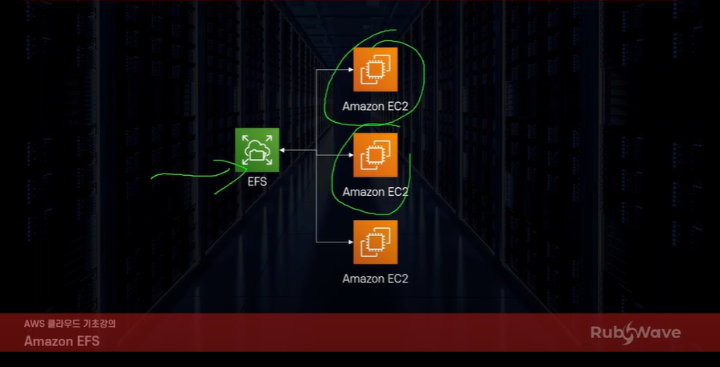
- Private Service : AWS 외부에서 접속 불가능
  - AWS외부에서 접속위해서는 VPN, Direct Connect 등 별도로 VPC와 연결 필요
- 각 가용영역에 Mount Target을 두고 각각의 가용영역에서 해당 Mount Target로 접근 (하나의 subnet은 하나의 가용영역이다. )
- Linux Only
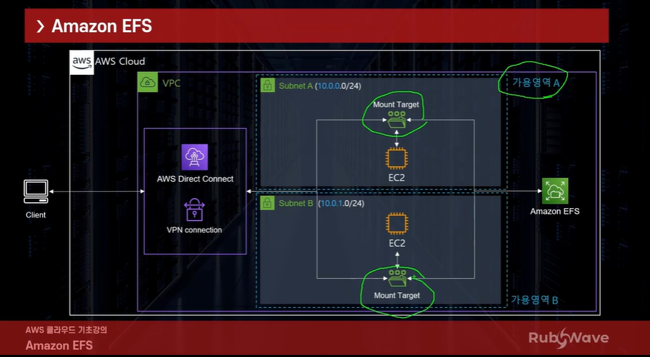
(Mount Target내에서 소통하기 때문에 바로 외부접속 불가능)

#### Amazon EFS 퍼포먼스 모드
- General Purpose : 가장 보편적인 모드. 거의 대부분 경우 사용 권장
- Max IO : 매우 높은 IOPS가 필요한 경우
  - 빅데이터, 미디어 처리 등

#### Throughput 모드
- Bursting Throughput 모드 : 낮은 Throughput일 때 크레딧을 모아서 높은 Throughput일 때 사용 (EC2 T타입과 비슷한 개념)
- Provisioned Throughput : 미리 지정한 만큼의 Throughput을 미리 확보해두고 사용(높은 Throughput이 필요할 때 선택)

#### 스토리지 클래스
- EFS Standard : 3개 이상의 가용영역에 보관
- EFS Standard-IA : 3개 이상의 가용영역에 보관, 조금 저렴한 비용 대신 데이터를 가져올 때 비용 발생
- EFS One Zone : 하나의 가용영역에 보관 -> 저장된 가용영역의 상황에 영향을 받을 수 있음(날라가면 끝) (덜 중요한 데이터)
- EFS One Zone - IA : 저장된 가용영역의 상황에 영향을 받을 수 있음, 데이터를 가져올 때 비용 발생(가장 저렴) : 별로 안중요하고, 엑세스 낮은 데이터

#### Amazon FSx 
(EFS의 윈도우 버전 / 온프레미스에서 액세스 가능)
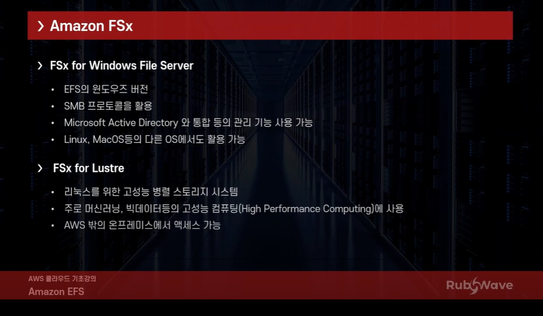

### 15강 사설IP & NAT & CIDR
#### Private IP 
‐ 한정된 IP주소를 최대한 활용하기 위해 IP주소를 분할하고자 만든 개념
  - IPv4기준으로 최대 IP개수는 43억개
- 사설망
  - 사설망 내부에는 외부 인터넷 망으로 통신이 불가능한 사설 IP로 구성
  - 외부로 통신할 때는 통신 가능한 공인 IP로 나누어 사용
  - 보통 하나의 망에는 사설 IP를 부여받은 기기들과 NAT 기능을 갖춘 Gateway로 구성
- 참고:IPv6 IP 개수 : 2의128제곱(320간)..? 약 43억x43억x43억x43억 개

#### NAT(Network Address Translation)
- NAT
  - 사설 IP가 공용 IP로 통신 할 수 있도록 주소를 변환해 주는 방법
  - 3가지 종류
    - Dynamic NAT : 1개 사설 IP를 NAT Pool에서 가용 가능한 공인 IP로 연결(사용안되는거 돌려쓰자~~)
    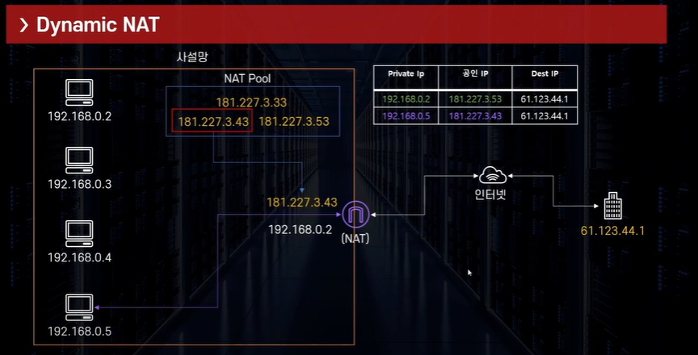
    - Static NAT : 하나의 사설 IP를 고정된 하나의 공인 IP로 연결
      - AWS Internet Gateway가 사용하는 방식
    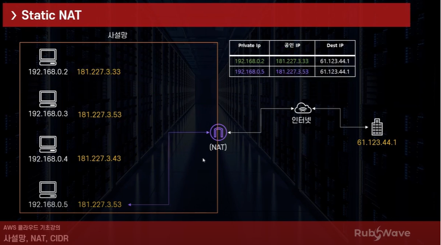
  - PAT(Port Address Translation) : 많은 사설 IP를 하나의 공인 IP로 연결 (집, 직장 등등..)
    - NAT Gateway/Nat Instance가 사용하는 방식 
    
    트래픽을 내보낼 때 SRC Port를 기억해서 내보내고, 다시 찾아서 돌려줌

#### Classless Inter Domain Routing(CIDR)
CLassless Inter Domain Routing
- IP는 주소의 영역을 여러 네트워크 영역으로 나누기 위해 IP를 묶는 방식
- 여러 개의 사설망을 구축하기 위해 망을 나누는 망법

#### CIDR Block / CIDR Noation
- CIDR Block : IP 주소의 집합
- CIDR Notation : CIDR Block을 표시하는 방법
  - 네트워크 주소와 호스트 주소로 구성
  - 각 호스트 주소 숫자 만큼의 IP를 가진 네트워크 망 형성 가능
- A.B.C.D/E 형식
  - 예 : 10.0.1.0/24, 172.16.0.0/12 
  - A.B.C.D: 네트워크 주소 + 호스트 주소 표시, E:0~32: 네트워크 주소가 몇 bit인지 표시

#### 서브넷
  - 네트워크 안의 네트워크
  - 큰 네트워크를 잘게 쪼갠 단위
  - 일정 IP주소의 범위를 보유
    - 큰 네트워크에 부여된 IP범위를 조금씩 잘라 작은 단위로 나눈 후 각 서브넷에 할당
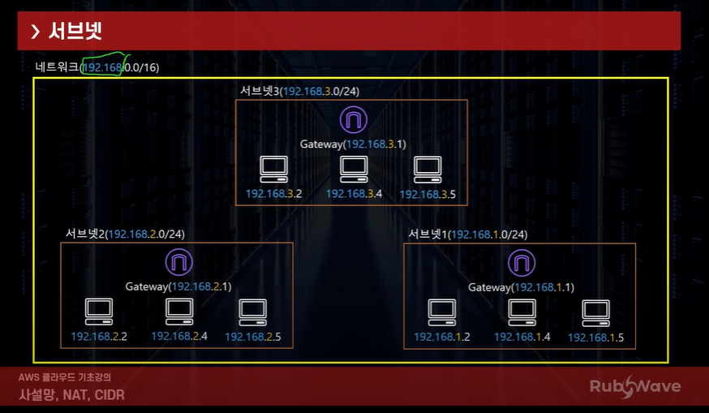
해당 화면의 경우 /16이기 때문에  32-16 = 16비트, 즉 2의16제곱만큼의 IP범위를 가진 큰 네트워크임.
여기서 서브넷/24로 나눈다는 것은, 32-24 = 8비트의 서브넷 네트워크를 
255개만큼 가질 수 있다는 것

### 16강 VPC와 Subnet

VPC는 원칙적으로 Public Internet에서 접근할 수 없다.
AWS내부라고 하더라도, 원칙적으로는 Internet  Gateway를 거쳐서 Public EndPoint를 통해 AWS Servcie로 가게된다.
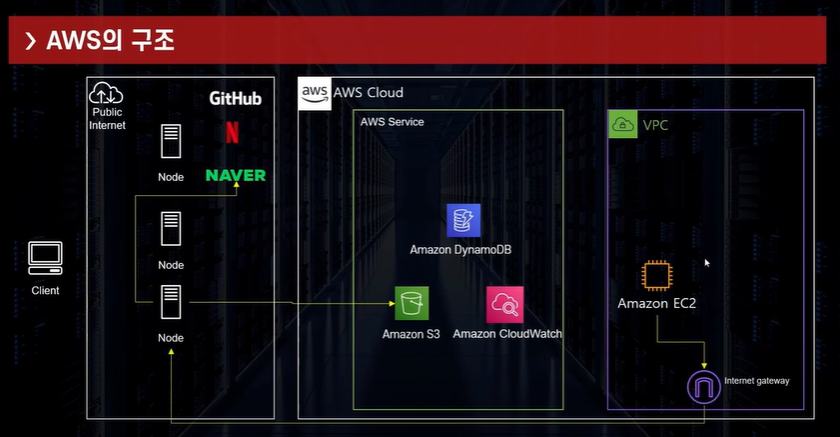

*Amazon EC2는 유일한 예외

- VPC
Virtual Private Could(VPC)는 사용자의 AWS 계정 전용 가상 네트워크 입니다. VPC는 AWS클라우드에서 다른 가상 네트워크와 논리적으로 분리되어 있습니다. Amazon EC2 인스턴스와 같은 AWS 리소스를 VPC에서 실행할 수 있습니다. IP 주소 범위와 VPC 범위를 설정하고 서브넷을 추가하고 보안 그룹을 연결할 다음 라우팅 테이블을 구성합니다.

VPC = 가상으로 존재하는 데이터센터
- 가상의 데이터센터
- 외부에 격리된 네트워크 컨테이너 구성 가능
- 리전 단위 
VPC의 사용 사례
- EC2, RDS, Lambda등의 AWS의 컴퓨팅 서비스 실행 
- 다양한 서브넷 구성
- 보안 설정(IP Block, 인터넷에 노출되지 않는 EC2등 구성)


### 서브넷의 종류
- 퍼블릭 서브넷 : 외부에서 인터넷을 통해 연결할 수 있는 서브넷
  - 인터넷 게이트웨이를 통해 외부의 인터넷과 연결되어 있음.
  - 안에 위치한 인스턴스에 퍼블릭 IP 부여 가능
  - 웹서버, 어플리케이션 서버 등 유저에게 노출되어야 하는 인프라
-  프라이빗 서브넷 : 외부에서 인터넷을 통해 연결할 수 없는 서브넷
  - 외부인터넷으로 경로가 없음 (매우 높은 보안)
  - 퍼블릭 IP 부여 불가능
  - 데이터베이스, 로직 서버 등 외부에 노출 될 필요가 없는 인프라..

- 인터넷 게이트웨이
  - VPC가 외부의 인터넷과 통신할 수 있도록 경로를 만들어주는 리소스
  - 기본적으로 확장성과 고가용성이 확보되어 있음
  - IPv4, IPv6 지원
    - IPv4의 경우 NAT 역할
  - Route Table에서 경로 설정 후에 접근 가능
  - 무료  


### 17강 보안그룹과 NACL
보안 그룹
- Network Access Control List(NACL)와 함께 방화벽의 역할을 하는 서비스
- Port 허용
  - 기본적으로 모든 포트는 비활성화
  - 선택적으로 트래픽이 지나갈 수 있는 Port와 Source를 설정 가능
  - Deny는 불가능 -> NACL로 가능함
- 인스턴스 단위
  - 하나의 인스턴스에 하나 이상의 SG설정 가능
  - NACL의 경우 서브넷 단위
  - 설정된 인스턴스는 설정한 모든 SG의 룰을 적용 받음

#### Stateful
*보안 그룹의 Stateful
- 보안 그룹은 Stateful
- Inbound로 들어온 트래픽이 별 다른 Outbound설정 없이 나갈 수 있음
- NACL은 Stateless
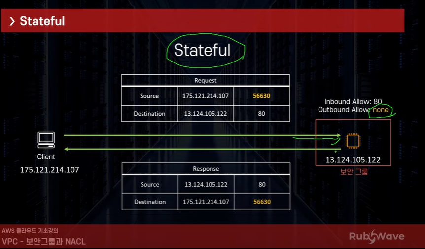
->Outbound Allow안 된 트래픽이어도, 한 번 들어온 포트는 기억해서 내보내줌

*Stateless는 들어갈 때, 나갈 때 규칙을 다 체크해서 허락/거절해줌

#### ACL(NACL)
- 보안그룹처럼 방화벽 역할을 담당
- 서브넷 단위
- 포트 및 아이피를 직접 Deny 가능
  - 외부 공격을 받는 상황 등 특정 아이피를 블록하고 싶을 때 사용
- 순서대로 규칙 평가(낮은 숫자부터)

#### NACL 규칙
- 규칙 번호 : 규칙에 부여되는 고유의 숫자이며 규칙이 평가되는 순서(낮은 번호 부터)
  - AWS 추천은 100단위 증가
- 유형 : 미리 지정된 프로토콜. 선택 시 AWS에서 잘 알려진 포트가 규칙에 적용됨
- 프로토콜 : 통신 프로토콜 (예:TCP, UDP, SMM..)
- 포트 범위 : 허용 혹은 거부할 포트 범위
- 소스 : IP 주소의 CIDR 블록
- 허용/거부 
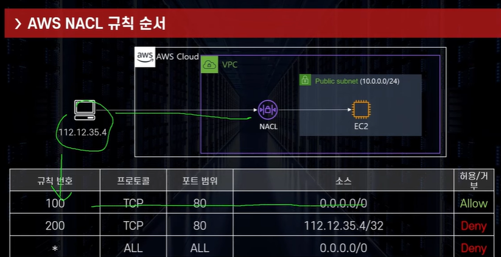
규칙번호 100번에 모든 IP를 허용하기 때문에
밑으로 내려가지 않고 바로 허용, 끝.
순서를 바꾸면 Deny됨.


#### 정리
보안그룹
- 가상의 방화벽
- 인스턴스 단위
- Port의 허용만 가능(Deny는 Nacl에서 가능)
- Stateful

NACL
- 가상의 방화벽
- 서브넷 단위
- Port의 허용/디나이 가능
- Stateless(출입 다 체크!)


#### CIDR 추가 공부
[출처:https://aws.amazon.com/ko/what-is/cidr/]
Classless Inter-Domain Routing은 인터넷상의 데이터 라우팅 효율성을 향상시키는 IP주소 할당 방법입니다. 인터넷에 연결되는 모든 컴퓨터, 서버 및 최종 사용자 디바이스에는 IP주소라는 고유한 번호가 연결되어 있습니다. 디바이스는 이러한 IP주소를 사용하여 서로 찾고 통신합니다. 조직에서는 CIDR을 사용하여 네트워크에 유연하고 효율적으로 IP 주소를 할당합니다.

IP주소는 두 부분으로 구성됩니다.
- 네트워크 주소는 네트워크 고유 식별자를 가리키는 일련의 숫자입니다.
- 호스트 주소는 네트워크상의 호스트 또는 개별 디바이스 식별자를 나타내는 일련의 숫자입니다.

클래스 기반 주소
IPv4 주소는 32비트로 구성됩니다. 마침표로 구분된 각 숫자 문자열은 8비트로 구성되며 0~255의 숫자 형식으로 표시됩니다. 조직에서는 3가지 클래스의 IPv4 주소를 구입할 수 있습니다.

클래스 A
클래스 A IPv4 주소는 네트워크 접두사가 8개 입니다. 예를들어 44.0.0.1에서 44는 네트워크 주소이고 0.0.1은 호스트 주소입니다.

클래스 B : 네트워크 접두사 16개
클래스 C : "" 24개 

클래스 없는 주소(Classless Inter_domain Routing/CIDR) 주소는 가변 길이 서브넷 마스킹을 사용하여 IP주소의 네트워크 호스트 주소 비트 간의 비율을 변경합니다. 서브넷 마스크는 호스트 주소를 0으로 변환하여 IP 주소의 네트워크 주소 값을 반환하는 식별자 집합입니다.

네트워크 관리자는 VLSM 시퀀스를 통해 IP 주소 공간을 다양한 크기의 서브넷으로 나눌 수 있습니다.

기존 클래스 기반 주소 지정 시스템은 IP주소를 할당하는 데 있어서 비효율적이고, IP주소 공간 낭비로 이어졌습니다.

예를 들어 디바이스가 300개인 조직에서는 디바이스를 254개만 허용하는 클래스 C IP 주소를 사용할 수 없었습니다. 따라서 6만 5,534개의 고유한 호스트 주소를 제공하는 클래스 B IP 주소를 신청해야 했습니다. 하지만 디바이스는 300개만 연결되었기 때문에 6만 5,234개의 IP 주소 공간은 사용되지 않은 채로 남게 되었습니다.

네트워크 설계의 제한
클래스 기반 IP에서는 필요에 따라 네트워크를 결합하는 기능이 제한되었습니다. 예를 들어 다음 IP 주소는 클래스 아키텍처에서 서로 다른 클래스 C 네트워크에 속합니다. 

192.168.1.0
192.168.0.0
네트워크 관리자는 이 두 네트워크를 결합할 수 없습니다. 클래스 C 서브넷 마스크가 255.255.255.0으로 고정되었기 때문입니다. 

CIDR을 사용하면 어떤 이점이 있나요?
Classless Inter-Domain Routing(CIDR)을 사용하면 보다 유연하게 IP 주소를 할당하고 디바이스 간에 데이터를 라우팅할 수 있습니다.

IP 주소 낭비 감소
CIDR은 IP 주소에 할당할 네트워크 및 호스트 식별자를 결정할 때 유연성을 제공합니다. CIDR을 사용하면 특정 네트워크에 필요한 수의 IP 주소를 프로비저닝하여 낭비를 줄일 수 있습니다. 또한 CIDR을 사용하면 라우팅 테이블 항목이 줄어들고 데이터 패킷 라우팅이 단순화됩니다. 

데이터를 빠르게 전송
CIDR을 사용하면 라우터에서 보다 효율적으로 IP 주소를 여러 서브넷으로 구성할 수 있습니다. 서브넷은 네트워크 내에 있는 소규모 네트워크입니다. 예를 들어 라우터에 연결된 모든 디바이스는 동일한 서브넷에 있고 동일한 IP 주소 접두사를 사용합니다.

CIDR을 사용하면 조직에서 여러 서브넷을 만들고 통합할 수 있습니다. 이렇게 하면 불필요한 경로를 사용하지 않고도 데이터가 대상 주소에 도달할 수 있습니다. 

CIDR은 어떻게 작동하나요?
Classless Inter-Domain Routing(CIDR)을 사용하면 네트워크 라우터에서 표시된 서브넷에 따라 해당하는 디바이스로 데이터 패킷을 라우팅할 수 있습니다. 라우터는 클래스에 따라 IP 주소를 분류하는 대신 CIDR 접미사에 지정된 네트워크 및 호스트 주소를 검색합니다.

CIDR의 작동 방식을 익히려면 CIDR 블록과 CIDR 표기법을 이해하는 것이 중요합니다.

### 18강 NAT Gateway & Bastion Host 

#### NAT Gateway
"NAT 게이트웨이는 Amazon Private Cloud(Amazon VPC)의 프라이빗 서브넷에 있는 인스턴스에서 인터넷에 쉽게 연결하 수 있도록 지원하는 가용성이 높은 AWS 관리형 서비스입니다.

NAT Gateway/NAT Instacne
- Private 인스턴스가 외부의 인터넷과 통신하기 위한 통로
- NAT Instance는 단일 EC2 인스턴스 / NAT Gateway는 AWS에서 제공하는 서비스 (NAT Gateway가 나오기 전까지 NAT Instance가 유일한 방법이었지만, NAT Gateway가 나오고나서는 거의 사용되지 않음. 간단한 테스트 정도.)
- NAT Gateway/Instance는 모두 서부넷 단위
  - Public Subnet에 있어야 함
  - NAT Gateway는 서비스이기 때문에 자동 관리됨.
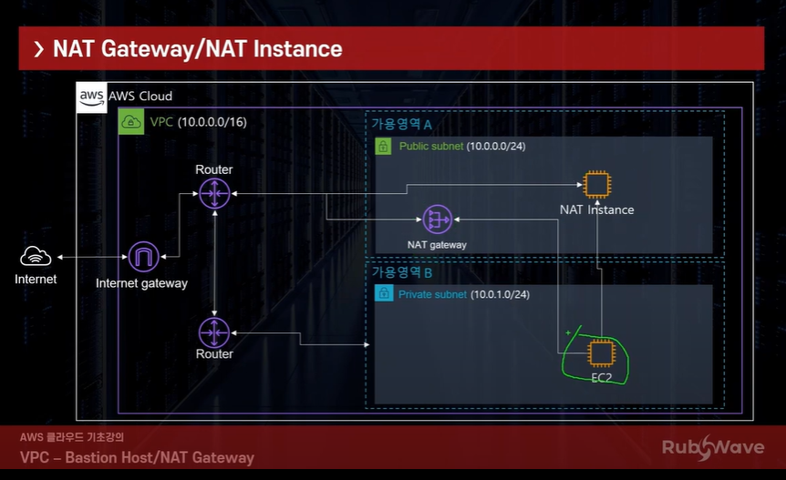

### Bastion Host
- Private 인스턴스에 접근하기 위한 EC2 인스턴스
(외부에서 들어가는 경로를 만들어준다.)
(여러 한계로 실전에서는 잘 쓰이지 않는다.)
(실전에서는 Session Manager가 보통 쓰임.)
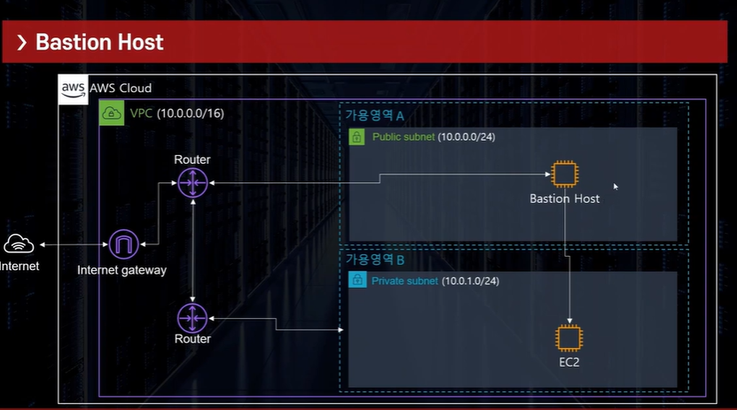

### 19강 VPC - 생성 실습

#### VPC 관련 배경지식
- 커스텀 VPC 생성 시 만들어지는 리소스 : 라우팅 테이블, 기본 NACL, 기본 보안그룹
  - 서브넷 생성 시 모두 기본 라우팅 테이블로 자동 연동
- 서브넷 생서 시 AWS는 총 5개의 IP를 미리 점유함.
- VPC에는 단 하나의 Internet Gateway만 생성 가능
  - Internet Gateway 생성 후 직접 VPC에 연동 필요
  - Internet Gateway는 자체적으로 고가용성/장애내구성을 확보
- 보안 그룹은 VPC 단위
- 서브넷은 가용영역 단위(1 서브넷 = 1 가용영역)
- 가장 작은 서브넷 단위는 /24(11개, 16-5)

#### 해본 작업
VPC 생성 
->라우팅 테이블, 네트워크 ACL, Default 보안그룹 자동 생성됨.

여기서 Subnet을 private, public, db 3개 나눠서 만들어줬음.
10.0.0.0/24로.
그리고 라우팅 테이블 private, db로 명명하여 만들어주고, 서브넷 할당으로 각 이름에 맞는 서브넷을 할당함.
그리고 인터넷 게이트웨이를 생성하여서 My VPC를 할당해줌. 
이 때 Default VPC는 목록에 나오지 않았는데, 이는 하나의 VPC는 하나의 Internet Gateway만 가질 수 있기 때문(Default VPC는 이미 Gateway가 있다.)

라우팅테이블 -
기존 설정한 10.0.0.0/16 이외의 트래픽들은 어디로 가냐~
인터넷 게이트웨이로 설정해줌.
+보안그룹 설정

Basion Host에서 private EC2에 접근하려면, key pair가 반드시 있어야함.

### 20강 Amazon S3 기초 

#### Simple Storage Service(S3)
Amazon Simple Storage Service는 업계 최고의 확장성과 데이터 가용성 및 보안과 성능을 제공하는 "객체 스토리지 서비스"입니다.
전세계 기업의 수백만 앱을 위한 데이터를 저장합니다.

- 객체 스토리지 서비스 : 파일 보관만 가능 <-> Block Storage Service -> 앱 설치가 불가
- 글로벌 서비스. 데이터는 리전에 저장
- 무제한 용량
  - 하나의 객체는 0byte 에서 5TB의 용량

#### 버킷
S3의 저장공간을 구분하는 단위.
디렉토리/폴더와 같은 개념
버킷이름은 전 세계에서 고유 값 : 리전에 관계 없이 중복된 이름이 존재할 수 없음.

#### S3객체의 구성
OWNER : 소유자
KEY : 파일의 이름
VALUE : 파일의 데이터
VERSION ID : 파일 버전 아이디
METADATA : 파일의 정보를 담은 데이터

#### S3의 내구성
최소 3개의 가용영역(AZ)에 데이터를 분산 저장(Standard의 경우)
99.99999999%의 내구성 (로또보다 122배 더 큼) (파일을 잃어버리지 않는 능력)
99.9% SLA 가용성(내가 원할 때 그 파일을 사용할수 있는 능력)

#### 보안 설정
S3 보안 설정
- S3 모든 버킷은 새로 생성시 기본 PRIVATE
- 보안 설정은 객체 단위와 버킷 단위로 구성 
  - Bucket Policy : 버킷 단위  (객체 단위는 거의 안쓰임)
- MFA를 활용해 객체 삭제 방지 가능
- Versioning을 통해 파일 관리 가능
- 액세스 로그 생성 및 전송 가능
  - 다른 버킷 혹은 다른 계정으로 전송 가능

#### 실습
-S3 버킷 만들어서 
-index.php파일을 업로드
-IAM역할에서 S3FullAccess권한 부여
-EC2인스턴스 생성 
-고급정보 :S3FullAccess부여된 IAM선택 + 인스턴스 올라갈 때 실행 코드로 해당 S3버킷에 접속해서, php를 다운받는 코드 실행.
해당 EC2 public 주소로 접속하면, index.php를 표시하는 것 확인 완료

### 21강 Amazon S3 Storage Class

#### S3 스토리지 클래스
S3는 다양한 스토리지 클래스를 제공
- 클래스별로 저장의 목적, 예산에 따라 다른 저장 방법을 적용
- 총 8가지 클래스

#### S3 스탠다드
- 99.99% 가용성
- 99.999999999% (Eleven Nine) 내구성
- 최소 3개 이상의 가용영역에 분산 보관
- 최소 보관 기간 없음, 최소 보관 용량 없음
- 파일 요청 비용 없음(전송 요금은 발생)

#### S3 스탠다드 IA (Infrequestly Accessed)
- 자주 사용되지 않는 데이터를 저렴한 가격에 보관
- 최소 3개 이상의 가용영역에 분산 보관
- 최소 저장 용량 : 128kb (더 작은 파일을 저장하더라도, 요금이 128kb기준으로 부담됨)
- 최소 저장 기간 : 30일 (즉, 1일만 저장해도 30일치 요금 발생)
- 데이터 요쳥 비용 발생 : 데이터를 불러올 때마다 비용 지불(per GB)
- 사용 사례 : 자주 사용하지 않는 파일 중 중요한 파일

#### S3 One Zone-IA
- 자주 사용x 중요 x 데이터를 저렴 가격에 보관
- but 한 개의 가용 영역에만 보관
- 최소 저장 용량 : 128kb
- 죄소 저장 기간 : 30일
- 데이터 요청 비용 발생 : per GB
- 사용 사례 : 자주 사용하지 않으며 쉽게 복수할수 있는 파일
  - 예: 오래된 썸네일 등등..

#### S3 Glacier Instant Retrieval
- 아카이브용 저장소
- 최소 저장 용량 : 128kb
- 최소 저장 기간 : 90일
- 바로 액세스 가능
- 사용 사례 : 의료 이미지, 뉴스 아카이브 등..(바로 액세스 필요 자료..)
- 비용: standard의 1/5

#### S3 Glacier Flexible Retrieval
- 아카이브용 저장소
- 최소 저장 용량 : 40kb
- 최소 저장 기간 : 90일
- 분~시간 단위 이후 액세스 가능(원할 때 바로 가져올 수 없음.)
- 사용 사례 : 장애 복구용 데이터, 백업 데이터 등..

#### S3 Glacier Deep Archive
- 아카이브용 저장소
- 최소 저장 용량 : 40kb
- 최소 저장 기간 : 90일
- 데이터를 가져오는데 12~48시간 소요
- 사용 사례 : 오래된 로그 저장, 사용할 일이 거의 없지만 법적으로 보관해야 하는 서류 등
- 비용 가장 저렴

#### S3 Intelligent-Tiering
- 머신 러닝을 사용해 자동으로 클래스 변경
- 퍼포먼스 손해/오버헤도 없이 요금 최적화

### 22강 Amazon S3 권한 관리
#### IAM 정책(Policy)의 종류
Identity-based policies(자격 증명 기반 정책)
- 자격 증명(IAM유저, 그룹, 역할)에 부여하는 정책
- 해당 자격증명이 무엇을 할 수 있는지 허용

Resource-based policies(리소스 기반 정책)
- 리소스(예:S3, SQS, VPC Endpoinnt, KMS 등)에 부여하는 정책
- 해당 리소스에 누가 무엇을 할 수 있는지 허용 가능
  - 예 : SQS 대기열에 Lambda Service가 접근 가능

리소스 정책이 허용되어있으면, 바로 허용

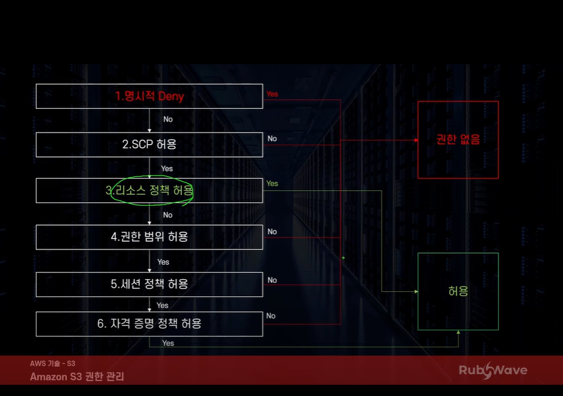

리소스 : 문이 나를 인식
자격 증명 기반 : 내가 열쇠를 가지고 들어감

#### S3 버킷 정책
- 버킷 단위로 부여되는 리소스 기반 정책
- 해당 버킷 데이터에 "언제 어디서 누가 무엇을 어떻게" 할 수 있는지 정의 가능
  - 리소스 계층 구조에 따라 권한 조절 가능
    - 예 : Resource : "arn:aws:s3:::my-bucket/images/*" -> my-bucket의ㅣ images/로 시작하는 모든 객체에 대해서...
  - 다른 계정의 엔티티에 대해 권한 설정 가능
  - 익명 사용자에 대한 권한 설정 가능
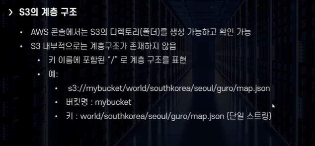
:계층구조처럼 보이지만, 그냥 키 이다. 

### S3 버킷 관리 방법의 선택
Identity-based policies(자격 증명 기반 정책)
- 같은 계정의 IAM 엔티티의 S3권한 관리할 때 
- S3이외에 다른 AWS 서비스와 같이 권한 관리할 때

Resource-based policies(리소스 기반 정책)
- 익명 사용자 혹은 다른 계정의 엔티티의 S3이용 권한을 관리할 때
- S3만의 권한을 관리할 때

### 23강 Amazon S3 버전관리/객체잠금
S3 버전 관리
- 객체의 생성, 업데이트, 삭제의 모든 단계를 저장
  - 삭제시에는 실제 객체를 삭제하는 대신 삭제 마커를 추가
- 버킷 단위로 활성화 필요(기본적으로 비활성화)
  - 중지 가능, 단 비활성화 불가능
  - 한번 버전관리를 시작하면 비활성화 불가능 (버킷 삭제 후 재생성으로 해결은 가능)
- 수명 주기 관리와 연동 가능
- 'MFA 인증 후 삭제' 기능을 통해 보안 강화 가능
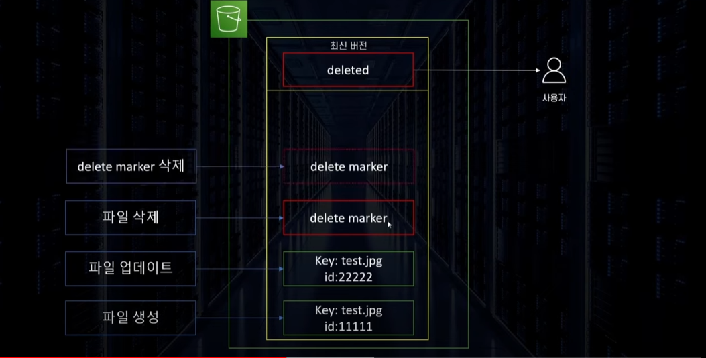

-> 22222버전 다시 등장

버전삭제도 가능.
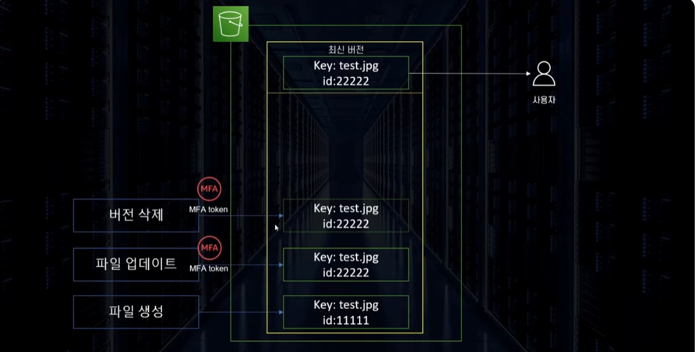
->보안강화

#### S3 버전 관리 유의사항
- S3 버전 관리 유의사항
  - 중지 가능, 단 비활성화 불가능
    - 한 번 버전 관리를 시작하면 비활성화 불가능(버킷 삭제 후 재생성으로 해결은 가능)
  - 모든 버전에 대해 비용 발생
    - 10gb 객체의 버전이 5개 있다면 총 50gb에 대해 비용 발생
  
#### S3 객체 잠금
- Write Once , Read Many(WORM) 모델을 활용하여 객체를 저장
- 고정된 시간, 혹은 무기한으로 객체의 삭제/덮어쓰기 방지 가능
- 규정 준수 및 객체의 보호를 위해 사용
- 버전의 활성화 필요

#### S3 객체 잠금의 종류
종류에 따라 두 가지 모드
- 보관모드(Retetion Mode) : 일정 기간동안 수정 방지
  - 규정 준수 모드 : 그 누구도 잠금 설정 변경, 객체 삭제 불가능(Root 포함, AWS 문의 포함)
  - 거버넌스 모드 : 특별한 권한 없이 삭제 혹은 잠금 설정 변경 불가능
    - 객체 삭제 방지 혹은 규정에 따라 보관하기 위해 사용
    - 규정 준수 모드의 테스트
- 법적 보존(Legal Hold)
  - Hold를 객체에 부여하고, Hold가 존재하는 한 객체 삭제, 수정 불가능
  - 제한 기간이 없음.
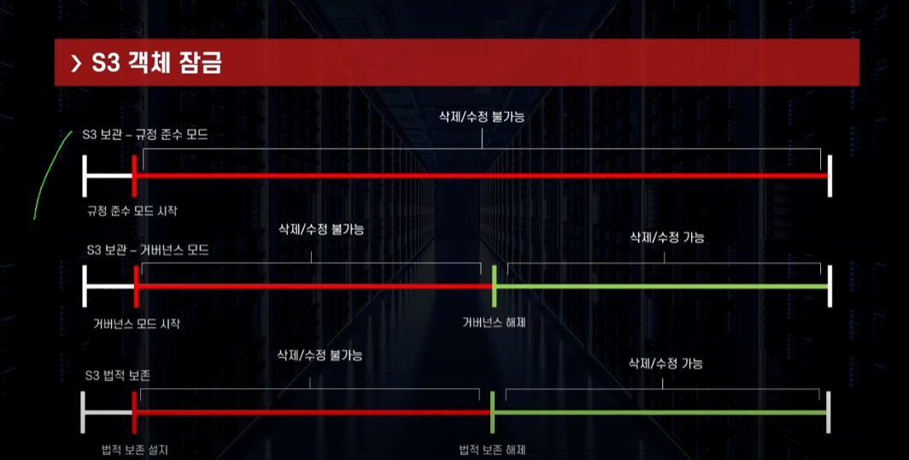

### 24강 Amazon S3 암호화
S3의 객체 암호화
-S3의 데이터의 암호화는 3가지 암호화로 구성
1. On Transit : SSL/TLS(HTTS)
2. At Rest(Server Side)
 - SSE S3 : S3에서 알아서 암호화
 - SSE KMS : KMS 서비스를 이용해 암호화
 - SSE CLIENT : 클라이언트에서 제공한 암호를 통해 암호화
3. Client Side : 클라이언트가 직접 암호화

#### SSE S3 : S3에서 알아서 암호화/복호화
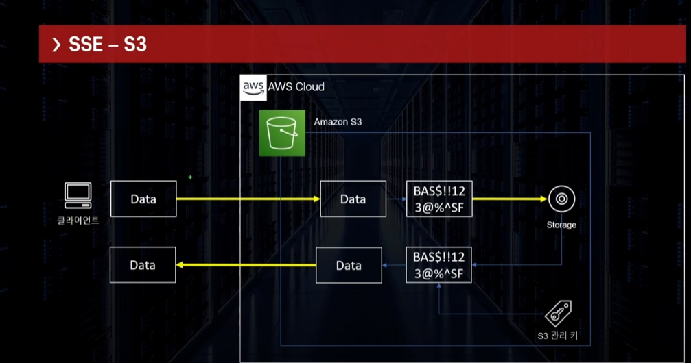

#### SSE KMS : KMS 서비스를 이용해 암호화
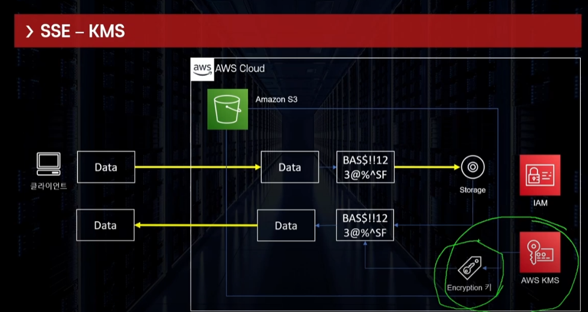

SSE S3와의 차이 : KMS서비스를 사용하고 있기 때문에, Encryption 키 관리 방법을 설정, 알 수 있음.
권한을 나눌 수 있음(S3권한 + KMS 권한 둘 다 있어야 파일을 열 수 있게 된다. EX.S3권한만 있으면 S3를 관리할 수 있지만 파일을 열수는 없음.)

#### SSE CLIENT : 클라이언트에서 제공한 암호를 통해 암호화
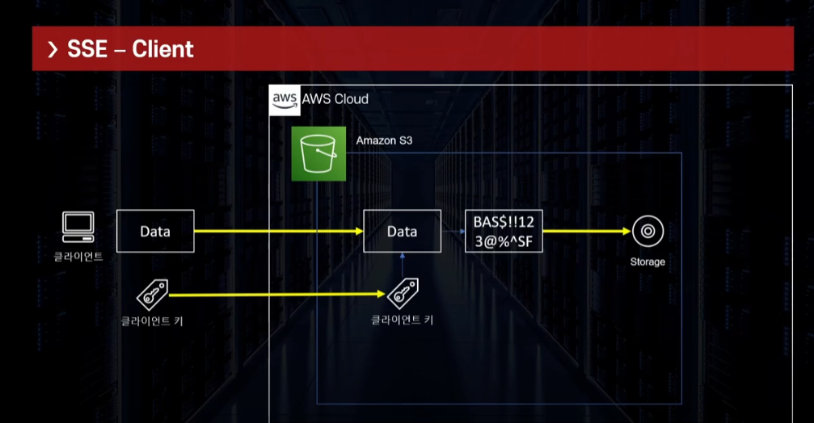
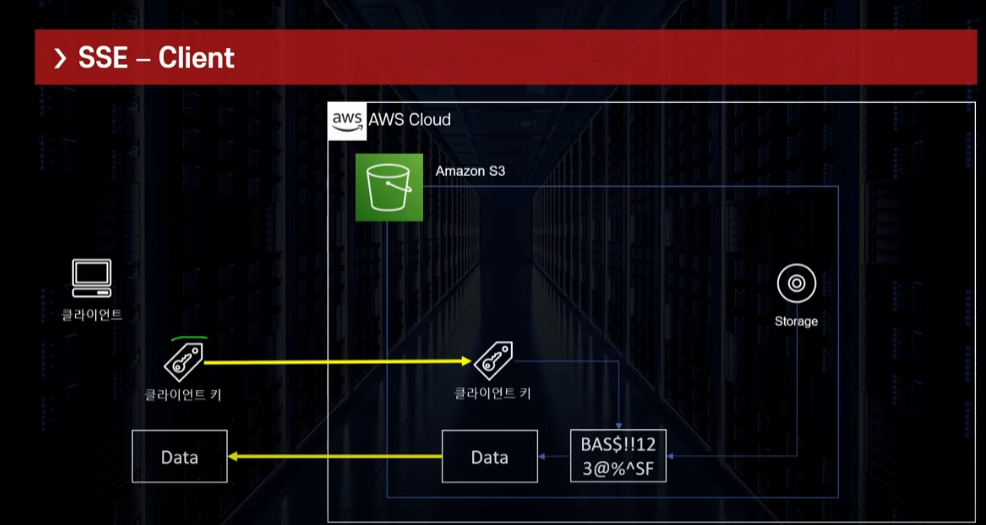

-> 업로드를 할 때, 클라이언트가 직접 암호화 키를 함께 올려서 암호화시킴.
파일을 가져올 때에도 해당 키로 복호화
단, S3에서 클아이언트키를 저장하지 않기 때문에, 직접 관리해야하고, 키 분실 시 데이터 영구 분실 

#### Client Side : 클라이언트가 직접 암호화
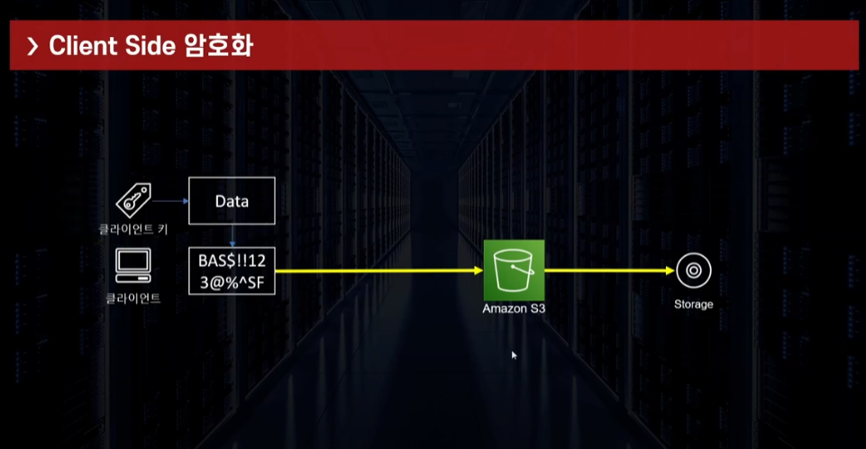

암호화 한 데이터를 S3에 저장. (가장 강력하지만 귀찮다..)

### 25강 AMAZON S3 정적 호스팅

#### Static VS Dynamic Contents
정적 컨텐츠(Static Contents)
- 서버에 저장된 파일이 모든 사용자에게 동일하게 전달되는 컨텐츠
- 매번 서버에 요청할 필요 없이 캐싱 가능
- HTML/javascript 등으로 구성
- 예 : 이미지, 글, 뉴스 등..

동적 컨텐츠(Dynamic Contents)
- 시간, 사용자, 입력 등에 따라 내용이 변경되는 컨텐츠
- 매번 서버에 요청하여 내용을 구서앟고 전달받아야 함
- PHP, JSP, ASp.net 등으로 서버 처리
- 예 : 로그인이 필요한 내용, 게시판, 댓글 등..

#### Amazon S3 Staic Hosting
- S3를 사용해서 정적(Static) 웹 컨텐츠를 호스팅하는 기능
- 별도의 서버 없이 웹사이트 호스팅 가능
- 고가용성/장애 내구성을 확보
- 사용 사례 : 대규모 접속이 예상되는 사전 예약 페이지, 홍보 페이지, 회사 웹사이트 등


#### Amazon S3 Static Hosting과 권한
- 정적 웹호스팅을 public으로 공개할 경우 : 불특정 다수에게 허용되는 권한 부여 필요
- 불특정 다수가 접속할 수 있는 권한을 확보하려면
  - S3 Block Public Access 해제 필요
  - Bucket Policy에서 정책 허용 필요

#### Amazon S3 Static Hosting의 활용
Route 53에서 보유한 도메인으로 연결 가능
- 단 버킷 명 = 호스팅 주소여야 가능
- 예 : test.example.com으로 호스팅하고 싶다면, 버킷명도 "test.example.com" 필요

#### Amazon CloudFront와 연동
- 일반적으로 HTTPS 프로토콜 구현을 위해서는 CloudFront와 연동 필요
- ACM을 통한 SSL 키 관리가 가장 편함
- 보통 Public hosting의 활성화 대신 그대로 Private 모드로 두고 OAI/OAC 등을 활용해서 보안 강화

#### 아키텍쳐(CloudFront)


#### 실습 
S3 버킷 생성(mystatic.tony.com)
- 퍼블릭제한 해제

정적 웹 사이트 호스팅 편집 - 정적 웹사이트 호스팅 활성화로 변경

html파일 업로드- 바로 mystatic.tony.com.s3~~~~에서 볼 수 있다.(퍼블릭 액세스)

.s3~~를 떼고 mystatic.tony.com만가지고 엑세스 하는 법 
ROUTE53에서 레코드 생성(레코드이름(mystatic), 유형, 리전선택)
 